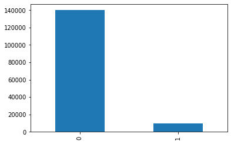
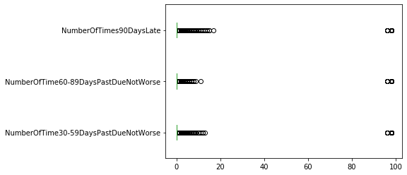
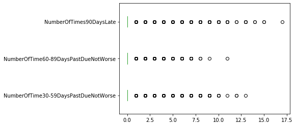
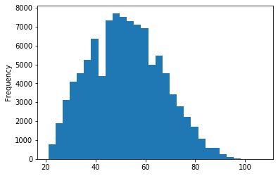
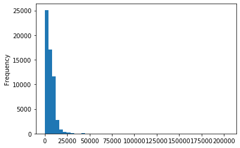
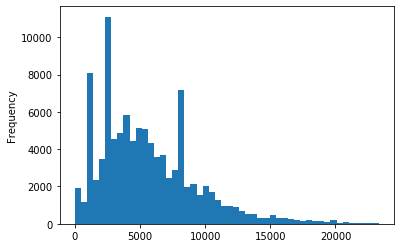
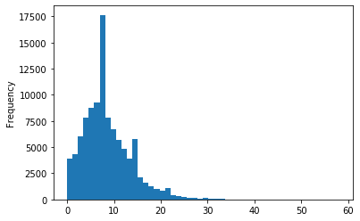
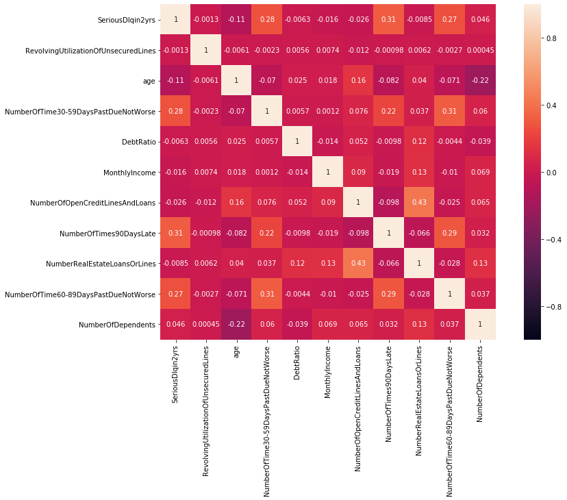
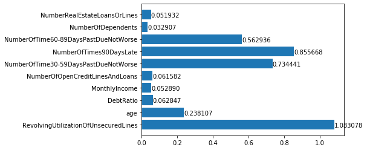
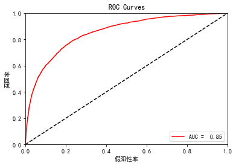

## 导入所需要的库


```python
# 数据分析和整理
import pandas as pd
import numpy as np
import random as rnd

# 可视化
import seaborn as sns
import matplotlib.pyplot as plt
%matplotlib inline

# 特征工程
from sklearn.preprocessing import KBinsDiscretizer
from sklearn.preprocessing import StandardScaler
from sklearn.model_selection import train_test_split
from sklearn.metrics import accuracy_score

# 机器学习模型
from sklearn.linear_model import LogisticRegression as LR
from sklearn.svm import SVC, LinearSVC
from sklearn.ensemble import RandomForestClassifier
from sklearn.ensemble import RandomForestRegressor
from sklearn.neighbors import KNeighborsClassifier
from sklearn.naive_bayes import GaussianNB
from sklearn.linear_model import Perceptron
from sklearn.linear_model import SGDClassifier
from sklearn.tree import DecisionTreeClassifier

#模型检验
from sklearn.metrics import roc_auc_score,roc_curve
from sklearn import metrics
from sklearn.metrics import confusion_matrix
from sklearn.model_selection import GridSearchCV
from sklearn.metrics import roc_curve, auc
```

## 获取数据


```python
#读取用户申请信息表数据
train_data=pd.read_csv("cs-training.csv",index_col=0)
```

## 数据初步探索


```python
train_data.shape
```


    (150000, 11)


```python
train_data.head()
```


<div>
<style scoped>
    .dataframe tbody tr th:only-of-type {
        vertical-align: middle;
    }

    .dataframe tbody tr th {
        vertical-align: top;
    }

    .dataframe thead th {
        text-align: right;
    }
</style>
<table border="1" class="dataframe">
  <thead>
    <tr style="text-align: right;">
      <th></th>
      <th>SeriousDlqin2yrs</th>
      <th>RevolvingUtilizationOfUnsecuredLines</th>
      <th>age</th>
      <th>NumberOfTime30-59DaysPastDueNotWorse</th>
      <th>DebtRatio</th>
      <th>MonthlyIncome</th>
      <th>NumberOfOpenCreditLinesAndLoans</th>
      <th>NumberOfTimes90DaysLate</th>
      <th>NumberRealEstateLoansOrLines</th>
      <th>NumberOfTime60-89DaysPastDueNotWorse</th>
      <th>NumberOfDependents</th>
    </tr>
  </thead>
  <tbody>
    <tr>
      <th>1</th>
      <td>1</td>
      <td>0.766127</td>
      <td>45</td>
      <td>2</td>
      <td>0.802982</td>
      <td>9120.0</td>
      <td>13</td>
      <td>0</td>
      <td>6</td>
      <td>0</td>
      <td>2.0</td>
    </tr>
    <tr>
      <th>2</th>
      <td>0</td>
      <td>0.957151</td>
      <td>40</td>
      <td>0</td>
      <td>0.121876</td>
      <td>2600.0</td>
      <td>4</td>
      <td>0</td>
      <td>0</td>
      <td>0</td>
      <td>1.0</td>
    </tr>
    <tr>
      <th>3</th>
      <td>0</td>
      <td>0.658180</td>
      <td>38</td>
      <td>1</td>
      <td>0.085113</td>
      <td>3042.0</td>
      <td>2</td>
      <td>1</td>
      <td>0</td>
      <td>0</td>
      <td>0.0</td>
    </tr>
    <tr>
      <th>4</th>
      <td>0</td>
      <td>0.233810</td>
      <td>30</td>
      <td>0</td>
      <td>0.036050</td>
      <td>3300.0</td>
      <td>5</td>
      <td>0</td>
      <td>0</td>
      <td>0</td>
      <td>0.0</td>
    </tr>
    <tr>
      <th>5</th>
      <td>0</td>
      <td>0.907239</td>
      <td>49</td>
      <td>1</td>
      <td>0.024926</td>
      <td>63588.0</td>
      <td>7</td>
      <td>0</td>
      <td>1</td>
      <td>0</td>
      <td>0.0</td>
    </tr>
  </tbody>
</table>
</div>


```python
train_data.tail()
```


<div>
<style scoped>
    .dataframe tbody tr th:only-of-type {
        vertical-align: middle;
    }

    .dataframe tbody tr th {
        vertical-align: top;
    }

    .dataframe thead th {
        text-align: right;
    }
</style>
<table border="1" class="dataframe">
  <thead>
    <tr style="text-align: right;">
      <th></th>
      <th>SeriousDlqin2yrs</th>
      <th>RevolvingUtilizationOfUnsecuredLines</th>
      <th>age</th>
      <th>NumberOfTime30-59DaysPastDueNotWorse</th>
      <th>DebtRatio</th>
      <th>MonthlyIncome</th>
      <th>NumberOfOpenCreditLinesAndLoans</th>
      <th>NumberOfTimes90DaysLate</th>
      <th>NumberRealEstateLoansOrLines</th>
      <th>NumberOfTime60-89DaysPastDueNotWorse</th>
      <th>NumberOfDependents</th>
    </tr>
  </thead>
  <tbody>
    <tr>
      <th>149996</th>
      <td>0</td>
      <td>0.040674</td>
      <td>74</td>
      <td>0</td>
      <td>0.225131</td>
      <td>2100.0</td>
      <td>4</td>
      <td>0</td>
      <td>1</td>
      <td>0</td>
      <td>0.0</td>
    </tr>
    <tr>
      <th>149997</th>
      <td>0</td>
      <td>0.299745</td>
      <td>44</td>
      <td>0</td>
      <td>0.716562</td>
      <td>5584.0</td>
      <td>4</td>
      <td>0</td>
      <td>1</td>
      <td>0</td>
      <td>2.0</td>
    </tr>
    <tr>
      <th>149998</th>
      <td>0</td>
      <td>0.246044</td>
      <td>58</td>
      <td>0</td>
      <td>3870.000000</td>
      <td>NaN</td>
      <td>18</td>
      <td>0</td>
      <td>1</td>
      <td>0</td>
      <td>0.0</td>
    </tr>
    <tr>
      <th>149999</th>
      <td>0</td>
      <td>0.000000</td>
      <td>30</td>
      <td>0</td>
      <td>0.000000</td>
      <td>5716.0</td>
      <td>4</td>
      <td>0</td>
      <td>0</td>
      <td>0</td>
      <td>0.0</td>
    </tr>
    <tr>
      <th>150000</th>
      <td>0</td>
      <td>0.850283</td>
      <td>64</td>
      <td>0</td>
      <td>0.249908</td>
      <td>8158.0</td>
      <td>8</td>
      <td>0</td>
      <td>2</td>
      <td>0</td>
      <td>0.0</td>
    </tr>
  </tbody>
</table>
</div>


```python
train_data.info()
```

    <class 'pandas.core.frame.DataFrame'>
    Int64Index: 150000 entries, 1 to 150000
    Data columns (total 11 columns):
    SeriousDlqin2yrs                        150000 non-null int64
    RevolvingUtilizationOfUnsecuredLines    150000 non-null float64
    age                                     150000 non-null int64
    NumberOfTime30-59DaysPastDueNotWorse    150000 non-null int64
    DebtRatio                               150000 non-null float64
    MonthlyIncome                           120269 non-null float64
    NumberOfOpenCreditLinesAndLoans         150000 non-null int64
    NumberOfTimes90DaysLate                 150000 non-null int64
    NumberRealEstateLoansOrLines            150000 non-null int64
    NumberOfTime60-89DaysPastDueNotWorse    150000 non-null int64
    NumberOfDependents                      146076 non-null float64
    dtypes: float64(4), int64(7)
    memory usage: 13.7 MB
    


```python
#查看缺失值
train_data.isnull().mean()
```


    SeriousDlqin2yrs                        0.000000
    RevolvingUtilizationOfUnsecuredLines    0.000000
    age                                     0.000000
    NumberOfTime30-59DaysPastDueNotWorse    0.000000
    DebtRatio                               0.000000
    MonthlyIncome                           0.198207
    NumberOfOpenCreditLinesAndLoans         0.000000
    NumberOfTimes90DaysLate                 0.000000
    NumberRealEstateLoansOrLines            0.000000
    NumberOfTime60-89DaysPastDueNotWorse    0.000000
    NumberOfDependents                      0.026160
    dtype: float64


```python
#查看数据分布
train_data.describe([0.01,0.1,0.25,0.5,0.75,0.9,0.99]).T
```


<div>
<style scoped>
    .dataframe tbody tr th:only-of-type {
        vertical-align: middle;
    }

    .dataframe tbody tr th {
        vertical-align: top;
    }

    .dataframe thead th {
        text-align: right;
    }
</style>
<table border="1" class="dataframe">
  <thead>
    <tr style="text-align: right;">
      <th></th>
      <th>count</th>
      <th>mean</th>
      <th>std</th>
      <th>min</th>
      <th>1%</th>
      <th>10%</th>
      <th>25%</th>
      <th>50%</th>
      <th>75%</th>
      <th>90%</th>
      <th>99%</th>
      <th>max</th>
    </tr>
  </thead>
  <tbody>
    <tr>
      <th>SeriousDlqin2yrs</th>
      <td>150000.0</td>
      <td>0.066840</td>
      <td>0.249746</td>
      <td>0.0</td>
      <td>0.0</td>
      <td>0.000000</td>
      <td>0.000000</td>
      <td>0.000000</td>
      <td>0.000000</td>
      <td>0.000000</td>
      <td>1.000000</td>
      <td>1.0</td>
    </tr>
    <tr>
      <th>RevolvingUtilizationOfUnsecuredLines</th>
      <td>150000.0</td>
      <td>6.048438</td>
      <td>249.755371</td>
      <td>0.0</td>
      <td>0.0</td>
      <td>0.002969</td>
      <td>0.029867</td>
      <td>0.154181</td>
      <td>0.559046</td>
      <td>0.981278</td>
      <td>1.092956</td>
      <td>50708.0</td>
    </tr>
    <tr>
      <th>age</th>
      <td>150000.0</td>
      <td>52.295207</td>
      <td>14.771866</td>
      <td>0.0</td>
      <td>24.0</td>
      <td>33.000000</td>
      <td>41.000000</td>
      <td>52.000000</td>
      <td>63.000000</td>
      <td>72.000000</td>
      <td>87.000000</td>
      <td>109.0</td>
    </tr>
    <tr>
      <th>NumberOfTime30-59DaysPastDueNotWorse</th>
      <td>150000.0</td>
      <td>0.421033</td>
      <td>4.192781</td>
      <td>0.0</td>
      <td>0.0</td>
      <td>0.000000</td>
      <td>0.000000</td>
      <td>0.000000</td>
      <td>0.000000</td>
      <td>1.000000</td>
      <td>4.000000</td>
      <td>98.0</td>
    </tr>
    <tr>
      <th>DebtRatio</th>
      <td>150000.0</td>
      <td>353.005076</td>
      <td>2037.818523</td>
      <td>0.0</td>
      <td>0.0</td>
      <td>0.030874</td>
      <td>0.175074</td>
      <td>0.366508</td>
      <td>0.868254</td>
      <td>1267.000000</td>
      <td>4979.040000</td>
      <td>329664.0</td>
    </tr>
    <tr>
      <th>MonthlyIncome</th>
      <td>120269.0</td>
      <td>6670.221237</td>
      <td>14384.674215</td>
      <td>0.0</td>
      <td>0.0</td>
      <td>2005.000000</td>
      <td>3400.000000</td>
      <td>5400.000000</td>
      <td>8249.000000</td>
      <td>11666.000000</td>
      <td>25000.000000</td>
      <td>3008750.0</td>
    </tr>
    <tr>
      <th>NumberOfOpenCreditLinesAndLoans</th>
      <td>150000.0</td>
      <td>8.452760</td>
      <td>5.145951</td>
      <td>0.0</td>
      <td>0.0</td>
      <td>3.000000</td>
      <td>5.000000</td>
      <td>8.000000</td>
      <td>11.000000</td>
      <td>15.000000</td>
      <td>24.000000</td>
      <td>58.0</td>
    </tr>
    <tr>
      <th>NumberOfTimes90DaysLate</th>
      <td>150000.0</td>
      <td>0.265973</td>
      <td>4.169304</td>
      <td>0.0</td>
      <td>0.0</td>
      <td>0.000000</td>
      <td>0.000000</td>
      <td>0.000000</td>
      <td>0.000000</td>
      <td>0.000000</td>
      <td>3.000000</td>
      <td>98.0</td>
    </tr>
    <tr>
      <th>NumberRealEstateLoansOrLines</th>
      <td>150000.0</td>
      <td>1.018240</td>
      <td>1.129771</td>
      <td>0.0</td>
      <td>0.0</td>
      <td>0.000000</td>
      <td>0.000000</td>
      <td>1.000000</td>
      <td>2.000000</td>
      <td>2.000000</td>
      <td>4.000000</td>
      <td>54.0</td>
    </tr>
    <tr>
      <th>NumberOfTime60-89DaysPastDueNotWorse</th>
      <td>150000.0</td>
      <td>0.240387</td>
      <td>4.155179</td>
      <td>0.0</td>
      <td>0.0</td>
      <td>0.000000</td>
      <td>0.000000</td>
      <td>0.000000</td>
      <td>0.000000</td>
      <td>0.000000</td>
      <td>2.000000</td>
      <td>98.0</td>
    </tr>
    <tr>
      <th>NumberOfDependents</th>
      <td>146076.0</td>
      <td>0.757222</td>
      <td>1.115086</td>
      <td>0.0</td>
      <td>0.0</td>
      <td>0.000000</td>
      <td>0.000000</td>
      <td>0.000000</td>
      <td>1.000000</td>
      <td>2.000000</td>
      <td>4.000000</td>
      <td>20.0</td>
    </tr>
  </tbody>
</table>
</div>


## 数据初步分析


```python
# 样本分布情况
train_data['SeriousDlqin2yrs'].value_counts().plot.bar()
```


    <matplotlib.axes._subplots.AxesSubplot at 0x1ea432e5320>





### 填充缺失值


```python
def fill_missing(data,to_fill):
    df=data.copy()
    columns=[*df.columns]
    columns.remove(to_fill)
    columns.remove("NumberOfDependents")
    x=df.loc[:,columns]
    y=df.loc[:,to_fill]
    x_train=x.loc[df[to_fill].notnull()]
    x_pred=x.loc[df[to_fill].isnull()]
    y_train=y.loc[df[to_fill].notnull()]
    model=RandomForestRegressor(random_state=0,
                               n_estimators=200,
                               max_depth=3,
                               n_jobs=-1)
    model.fit(x_train,y_train)
    pred=model.predict(x_pred)
    df.loc[df[to_fill].isnull(),to_fill]=pred
    return df
```


```python
train_data=fill_missing(train_data,'MonthlyIncome')
```


```python
train_data.info()
```

    <class 'pandas.core.frame.DataFrame'>
    Int64Index: 150000 entries, 1 to 150000
    Data columns (total 11 columns):
    SeriousDlqin2yrs                        150000 non-null int64
    RevolvingUtilizationOfUnsecuredLines    150000 non-null float64
    age                                     150000 non-null int64
    NumberOfTime30-59DaysPastDueNotWorse    150000 non-null int64
    DebtRatio                               150000 non-null float64
    MonthlyIncome                           150000 non-null float64
    NumberOfOpenCreditLinesAndLoans         150000 non-null int64
    NumberOfTimes90DaysLate                 150000 non-null int64
    NumberRealEstateLoansOrLines            150000 non-null int64
    NumberOfTime60-89DaysPastDueNotWorse    150000 non-null int64
    NumberOfDependents                      146076 non-null float64
    dtypes: float64(4), int64(7)
    memory usage: 13.7 MB
    


```python
train_data[['SeriousDlqin2yrs', 'NumberOfDependents']].groupby(['NumberOfDependents']).mean().sort_values(by='SeriousDlqin2yrs', ascending=False)
```


<div>
<style scoped>
    .dataframe tbody tr th:only-of-type {
        vertical-align: middle;
    }

    .dataframe tbody tr th {
        vertical-align: top;
    }

    .dataframe thead th {
        text-align: right;
    }
</style>
<table border="1" class="dataframe">
  <thead>
    <tr style="text-align: right;">
      <th></th>
      <th>SeriousDlqin2yrs</th>
    </tr>
    <tr>
      <th>NumberOfDependents</th>
      <th></th>
    </tr>
  </thead>
  <tbody>
    <tr>
      <th>6.0</th>
      <td>0.151899</td>
    </tr>
    <tr>
      <th>4.0</th>
      <td>0.103774</td>
    </tr>
    <tr>
      <th>7.0</th>
      <td>0.098039</td>
    </tr>
    <tr>
      <th>5.0</th>
      <td>0.091153</td>
    </tr>
    <tr>
      <th>3.0</th>
      <td>0.088263</td>
    </tr>
    <tr>
      <th>8.0</th>
      <td>0.083333</td>
    </tr>
    <tr>
      <th>2.0</th>
      <td>0.081139</td>
    </tr>
    <tr>
      <th>1.0</th>
      <td>0.073529</td>
    </tr>
    <tr>
      <th>0.0</th>
      <td>0.058629</td>
    </tr>
    <tr>
      <th>9.0</th>
      <td>0.000000</td>
    </tr>
    <tr>
      <th>10.0</th>
      <td>0.000000</td>
    </tr>
    <tr>
      <th>13.0</th>
      <td>0.000000</td>
    </tr>
    <tr>
      <th>20.0</th>
      <td>0.000000</td>
    </tr>
  </tbody>
</table>
</div>


```python
# 家庭成员数不同违约情况不同，说明NumberOfDependents对违约产生影响
# 有部分缺失值

```


```python
train_data.dropna(inplace=True)
```

### 处理异常值


```python
train_data.info()
```

    <class 'pandas.core.frame.DataFrame'>
    Int64Index: 146076 entries, 1 to 150000
    Data columns (total 11 columns):
    SeriousDlqin2yrs                        146076 non-null int64
    RevolvingUtilizationOfUnsecuredLines    146076 non-null float64
    age                                     146076 non-null int64
    NumberOfTime30-59DaysPastDueNotWorse    146076 non-null int64
    DebtRatio                               146076 non-null float64
    MonthlyIncome                           146076 non-null float64
    NumberOfOpenCreditLinesAndLoans         146076 non-null int64
    NumberOfTimes90DaysLate                 146076 non-null int64
    NumberRealEstateLoansOrLines            146076 non-null int64
    NumberOfTime60-89DaysPastDueNotWorse    146076 non-null int64
    NumberOfDependents                      146076 non-null float64
    dtypes: float64(4), int64(7)
    memory usage: 13.4 MB
    


```python
col=["NumberOfTime30-59DaysPastDueNotWorse","NumberOfTime60-89DaysPastDueNotWorse","NumberOfTimes90DaysLate"]
```


```python
train_data[col].plot.box(vert=False)
```


    <matplotlib.axes._subplots.AxesSubplot at 0x1ea432a93c8>





```python
for i in col:
    train_data=train_data.loc[train_data[i]<90]
```


```python
train_data[col].plot.box(vert=False)
```


    <matplotlib.axes._subplots.AxesSubplot at 0x1ea43011b38>





### 划分数据集


```python
Y=train_data['SeriousDlqin2yrs']
X=train_data.iloc[:,1:]
```


```python
X_train,X_test,Y_train,Y_test=train_test_split(X,Y,test_size=0.3)
```


```python
model_data=pd.concat([Y_train,X_train],axis=1)
```


```python
test_data=pd.concat([Y_test,X_test],axis=1)
```


```python

```

### 数据初步统计分析


```python
model_data.age.plot.hist(bins=30)
```


    <matplotlib.axes._subplots.AxesSubplot at 0x1ea43147c88>





```python
model_data.describe([0.1,0.99]).T
```


<div>
<style scoped>
    .dataframe tbody tr th:only-of-type {
        vertical-align: middle;
    }

    .dataframe tbody tr th {
        vertical-align: top;
    }

    .dataframe thead th {
        text-align: right;
    }
</style>
<table border="1" class="dataframe">
  <thead>
    <tr style="text-align: right;">
      <th></th>
      <th>count</th>
      <th>mean</th>
      <th>std</th>
      <th>min</th>
      <th>10%</th>
      <th>50%</th>
      <th>99%</th>
      <th>max</th>
    </tr>
  </thead>
  <tbody>
    <tr>
      <th>SeriousDlqin2yrs</th>
      <td>102086.0</td>
      <td>0.065886</td>
      <td>0.248083</td>
      <td>0.0</td>
      <td>0.000000</td>
      <td>0.000000</td>
      <td>1.000000</td>
      <td>1.0</td>
    </tr>
    <tr>
      <th>RevolvingUtilizationOfUnsecuredLines</th>
      <td>102086.0</td>
      <td>6.288841</td>
      <td>262.975927</td>
      <td>0.0</td>
      <td>0.003364</td>
      <td>0.158667</td>
      <td>1.095083</td>
      <td>50708.0</td>
    </tr>
    <tr>
      <th>age</th>
      <td>102086.0</td>
      <td>52.161521</td>
      <td>14.593852</td>
      <td>21.0</td>
      <td>33.000000</td>
      <td>52.000000</td>
      <td>86.000000</td>
      <td>107.0</td>
    </tr>
    <tr>
      <th>NumberOfTime30-59DaysPastDueNotWorse</th>
      <td>102086.0</td>
      <td>0.248702</td>
      <td>0.702982</td>
      <td>0.0</td>
      <td>0.000000</td>
      <td>0.000000</td>
      <td>3.000000</td>
      <td>13.0</td>
    </tr>
    <tr>
      <th>DebtRatio</th>
      <td>102086.0</td>
      <td>335.613964</td>
      <td>1944.056961</td>
      <td>0.0</td>
      <td>0.032258</td>
      <td>0.358489</td>
      <td>4957.300000</td>
      <td>326442.0</td>
    </tr>
    <tr>
      <th>MonthlyIncome</th>
      <td>102086.0</td>
      <td>6168.471063</td>
      <td>15253.842149</td>
      <td>0.0</td>
      <td>1200.000000</td>
      <td>5000.000000</td>
      <td>23500.000000</td>
      <td>3008750.0</td>
    </tr>
    <tr>
      <th>NumberOfOpenCreditLinesAndLoans</th>
      <td>102086.0</td>
      <td>8.559538</td>
      <td>5.158380</td>
      <td>0.0</td>
      <td>3.000000</td>
      <td>8.000000</td>
      <td>25.000000</td>
      <td>58.0</td>
    </tr>
    <tr>
      <th>NumberOfTimes90DaysLate</th>
      <td>102086.0</td>
      <td>0.090580</td>
      <td>0.482067</td>
      <td>0.0</td>
      <td>0.000000</td>
      <td>0.000000</td>
      <td>2.000000</td>
      <td>17.0</td>
    </tr>
    <tr>
      <th>NumberRealEstateLoansOrLines</th>
      <td>102086.0</td>
      <td>1.034784</td>
      <td>1.131270</td>
      <td>0.0</td>
      <td>0.000000</td>
      <td>1.000000</td>
      <td>5.000000</td>
      <td>54.0</td>
    </tr>
    <tr>
      <th>NumberOfTime60-89DaysPastDueNotWorse</th>
      <td>102086.0</td>
      <td>0.065298</td>
      <td>0.330054</td>
      <td>0.0</td>
      <td>0.000000</td>
      <td>0.000000</td>
      <td>2.000000</td>
      <td>9.0</td>
    </tr>
    <tr>
      <th>NumberOfDependents</th>
      <td>102086.0</td>
      <td>0.760104</td>
      <td>1.118466</td>
      <td>0.0</td>
      <td>0.000000</td>
      <td>0.000000</td>
      <td>4.000000</td>
      <td>13.0</td>
    </tr>
  </tbody>
</table>
</div>


```python
model_data.MonthlyIncome.loc[model_data.MonthlyIncome].plot.hist(bins=50)
```

    D:\ProgramData\Anaconda3\lib\site-packages\ipykernel_launcher.py:1: FutureWarning: 
    Passing list-likes to .loc or [] with any missing label will raise
    KeyError in the future, you can use .reindex() as an alternative.
    
    See the documentation here:
    https://pandas.pydata.org/pandas-docs/stable/indexing.html#deprecate-loc-reindex-listlike
      """Entry point for launching an IPython kernel.
    


    <matplotlib.axes._subplots.AxesSubplot at 0x1ea432f87f0>





```python
model_data.MonthlyIncome.loc[model_data.MonthlyIncome<23400].plot.hist(bins=50)
```


    <matplotlib.axes._subplots.AxesSubplot at 0x1ea431dd208>





```python
model_data.MonthlyIncome.min()
```


    0.0


```python
model_data.NumberOfOpenCreditLinesAndLoans.plot.hist(bins=50)
```


    <matplotlib.axes._subplots.AxesSubplot at 0x1ea432cae10>





```python

```


```python
#绘制变量关系的相关关系矩阵
model_corr = model_data.corr()
model_corr
```


<div>
<style scoped>
    .dataframe tbody tr th:only-of-type {
        vertical-align: middle;
    }

    .dataframe tbody tr th {
        vertical-align: top;
    }

    .dataframe thead th {
        text-align: right;
    }
</style>
<table border="1" class="dataframe">
  <thead>
    <tr style="text-align: right;">
      <th></th>
      <th>SeriousDlqin2yrs</th>
      <th>RevolvingUtilizationOfUnsecuredLines</th>
      <th>age</th>
      <th>NumberOfTime30-59DaysPastDueNotWorse</th>
      <th>DebtRatio</th>
      <th>MonthlyIncome</th>
      <th>NumberOfOpenCreditLinesAndLoans</th>
      <th>NumberOfTimes90DaysLate</th>
      <th>NumberRealEstateLoansOrLines</th>
      <th>NumberOfTime60-89DaysPastDueNotWorse</th>
      <th>NumberOfDependents</th>
    </tr>
  </thead>
  <tbody>
    <tr>
      <th>SeriousDlqin2yrs</th>
      <td>1.000000</td>
      <td>-0.001273</td>
      <td>-0.111103</td>
      <td>0.277263</td>
      <td>-0.006268</td>
      <td>-0.016072</td>
      <td>-0.026190</td>
      <td>0.314921</td>
      <td>-0.008480</td>
      <td>0.267957</td>
      <td>0.045772</td>
    </tr>
    <tr>
      <th>RevolvingUtilizationOfUnsecuredLines</th>
      <td>-0.001273</td>
      <td>1.000000</td>
      <td>-0.006097</td>
      <td>-0.002319</td>
      <td>0.005603</td>
      <td>0.007429</td>
      <td>-0.011798</td>
      <td>-0.000980</td>
      <td>0.006217</td>
      <td>-0.002677</td>
      <td>0.000450</td>
    </tr>
    <tr>
      <th>age</th>
      <td>-0.111103</td>
      <td>-0.006097</td>
      <td>1.000000</td>
      <td>-0.069951</td>
      <td>0.025147</td>
      <td>0.018171</td>
      <td>0.155567</td>
      <td>-0.081536</td>
      <td>0.039654</td>
      <td>-0.071272</td>
      <td>-0.215945</td>
    </tr>
    <tr>
      <th>NumberOfTime30-59DaysPastDueNotWorse</th>
      <td>0.277263</td>
      <td>-0.002319</td>
      <td>-0.069951</td>
      <td>1.000000</td>
      <td>0.005735</td>
      <td>0.001242</td>
      <td>0.075578</td>
      <td>0.221918</td>
      <td>0.036840</td>
      <td>0.314032</td>
      <td>0.059798</td>
    </tr>
    <tr>
      <th>DebtRatio</th>
      <td>-0.006268</td>
      <td>0.005603</td>
      <td>0.025147</td>
      <td>0.005735</td>
      <td>1.000000</td>
      <td>-0.013740</td>
      <td>0.051575</td>
      <td>-0.009821</td>
      <td>0.117247</td>
      <td>-0.004386</td>
      <td>-0.039212</td>
    </tr>
    <tr>
      <th>MonthlyIncome</th>
      <td>-0.016072</td>
      <td>0.007429</td>
      <td>0.018171</td>
      <td>0.001242</td>
      <td>-0.013740</td>
      <td>1.000000</td>
      <td>0.090176</td>
      <td>-0.018918</td>
      <td>0.125488</td>
      <td>-0.010370</td>
      <td>0.069452</td>
    </tr>
    <tr>
      <th>NumberOfOpenCreditLinesAndLoans</th>
      <td>-0.026190</td>
      <td>-0.011798</td>
      <td>0.155567</td>
      <td>0.075578</td>
      <td>0.051575</td>
      <td>0.090176</td>
      <td>1.000000</td>
      <td>-0.098037</td>
      <td>0.428973</td>
      <td>-0.025217</td>
      <td>0.065344</td>
    </tr>
    <tr>
      <th>NumberOfTimes90DaysLate</th>
      <td>0.314921</td>
      <td>-0.000980</td>
      <td>-0.081536</td>
      <td>0.221918</td>
      <td>-0.009821</td>
      <td>-0.018918</td>
      <td>-0.098037</td>
      <td>1.000000</td>
      <td>-0.065952</td>
      <td>0.290544</td>
      <td>0.032145</td>
    </tr>
    <tr>
      <th>NumberRealEstateLoansOrLines</th>
      <td>-0.008480</td>
      <td>0.006217</td>
      <td>0.039654</td>
      <td>0.036840</td>
      <td>0.117247</td>
      <td>0.125488</td>
      <td>0.428973</td>
      <td>-0.065952</td>
      <td>1.000000</td>
      <td>-0.028068</td>
      <td>0.127400</td>
    </tr>
    <tr>
      <th>NumberOfTime60-89DaysPastDueNotWorse</th>
      <td>0.267957</td>
      <td>-0.002677</td>
      <td>-0.071272</td>
      <td>0.314032</td>
      <td>-0.004386</td>
      <td>-0.010370</td>
      <td>-0.025217</td>
      <td>0.290544</td>
      <td>-0.028068</td>
      <td>1.000000</td>
      <td>0.037127</td>
    </tr>
    <tr>
      <th>NumberOfDependents</th>
      <td>0.045772</td>
      <td>0.000450</td>
      <td>-0.215945</td>
      <td>0.059798</td>
      <td>-0.039212</td>
      <td>0.069452</td>
      <td>0.065344</td>
      <td>0.032145</td>
      <td>0.127400</td>
      <td>0.037127</td>
      <td>1.000000</td>
    </tr>
  </tbody>
</table>
</div>


```python
#画出相关性热力图
a = plt.subplots(figsize=(15,9))#调整画布大小
a = sns.heatmap(model_corr, vmin=-1, vmax=1 , annot=True , square=True)#画热力图
```





### 变量选择

#### 分组

##### 类别较多的分组


```python
# 自动最优分组函数
```


```python
def auto_bin(DF,X,Y,n=3,iv=True,woe=False,q=20):
    DF=DF[[X,Y]].copy()
    #按照等深进行分箱
    DF['qcut'],bins=pd.qcut(DF[X],q=20,retbins=True,duplicates='drop')
    #统计每个分箱中SeriousDlqin2yrs 0,1的数量
    count_y0=DF.loc[DF[Y]==0].groupby(by='qcut')[Y].count()
    count_y1=DF.loc[DF[Y]==1].groupby(by='qcut')[Y].count()
    #每个区间的上界，下届，0的频数，1的频数
    num_bins=[*zip(bins,bins[1:],count_y0,count_y1)]

    #确保每一个分组中都包含0和1
    for i in range(20):
        #如果第一组没有0或1，向后合并
        if 0 in num_bins[0][2:]:
            num_bins[0:2]=[(
                num_bins[0][0],
                num_bins[1][1],
            num_bins[0][2]+num_bins[1][2],
            num_bins[0][3]+num_bins[1][3])]
            continue
        #其他组没有0或1，向前合并
        for i in range(len(num_bins)):
            if 0 in num_bins[i][2:]:
                num_bins[i-1:i+1]=[(
                num_bins[i-1][0],
                num_bins[i][1],
                num_bins[i-1][2]+num_bins[i][2],
                num_bins[i-1][3]+num_bins[i-1][3])]
                break
        else:
                break
    #定义计算woe的函数
    def get_woe(num_bins):
        columns=["min","max","good","bad"]
        df=pd.DataFrame(num_bins,columns=columns)
        df['total']=df.good+df.bad
        df['percebtage']=df.total/df.total.sum()
        df["woe"]=np.log((df.good/df.good.sum())/(df.bad/df.bad.sum()))
        return df
    #定义计算IV值函数
    def get_iv(bins_df):
        rate=((bins_df.good/bins_df.good.sum())-(bins_df.bad/bins_df.bad.sum()))
        iv=np.sum(rate*bins_df.woe)
        return iv
#基于卡方检验进行分析。
#原假设：观察频数与期望的频数没有差异
#如果P很小意味着两者偏离程度比较大，应该拒绝原假设
#获取两两之间的卡方检验的置信度，如果p比较大
#n为保留的最小组数
    
    while len(num_bins)>n:
        pvs=[]
        for i in range(len(num_bins)-1):
            x1=num_bins[i][2:]
            x2=num_bins[i+1][2:]
            pv=scipy.stats.chi2_contingency([x1,x2])[1]
            pvs.append(pv)
        #将P值最大两组进行合并  
        i=pvs.index(max(pvs))
        num_bins[i:i+2]=[(
        num_bins[i][0],
        num_bins[i+1][1],
        num_bins[i][2]+num_bins[i+1][2],
        num_bins[i][3]+num_bins[i+1][3])]
        #打印每组的分箱信息（woe，iv）
        bins_df=get_woe(num_bins)
        if iv:
            print(f"{X}分{len(num_bins):2}组的IV值",get_iv(bins_df))
        if woe:
            print(bins_df)
    return get_woe(num_bins)
```


```python
# #查看每一个字段，观察是否需要自动分箱
for i in model_data.columns:
    print (i)
    model_counts = model_data[i].value_counts().count()
    print (model_counts)
```

    SeriousDlqin2yrs
    2
    RevolvingUtilizationOfUnsecuredLines
    86626
    age
    83
    NumberOfTime30-59DaysPastDueNotWorse
    13
    DebtRatio
    82281
    MonthlyIncome
    12112
    NumberOfOpenCreditLinesAndLoans
    57
    NumberOfTimes90DaysLate
    17
    NumberRealEstateLoansOrLines
    24
    NumberOfTime60-89DaysPastDueNotWorse
    10
    NumberOfDependents
    12
    

根据最优分箱函数确认RevolvingUtilizationOfUnsecuredLines，age，DebtRatio，MonthlyIncome的最优分箱数
- RevolvingUtilizationOfUnsecuredLines  5组比较合适
- age       6组比较合适
- DebtRatio   5组比较合适
- MonthlyIncome   3组比较合适
- NumberOfOpenCreditLinesAndLoans  5组比较合适


```python
#根据最优分箱函数确认每个字段的最优分箱数
auto_bin(model_data,'RevolvingUtilizationOfUnsecuredLines','SeriousDlqin2yrs',n=3,woe=True,q=20)
```

    RevolvingUtilizationOfUnsecuredLines分18组的IV值 1.123956461030925
             min           max   good   bad  total  percebtage       woe
    0   0.000000      0.003364   9951   258  10209    0.100004  1.000790
    1   0.003364      0.010893   5042    62   5104    0.049997  1.746745
    2   0.010893      0.031016  10051   158  10209    0.100004  1.501154
    3   0.031016      0.044951   5030    74   5104    0.049997  1.567432
    4   0.044951      0.062423   5018    86   5104    0.049997  1.414761
    5   0.062423      0.086325   4995   110   5105    0.050007  1.164034
    6   0.086325      0.117463   5004   100   5104    0.049997  1.261144
    7   0.117463      0.158667   4940   164   5104    0.049997  0.753576
    8   0.158667      0.211497   4962   142   5104    0.049997  0.902059
    9   0.211497      0.275730   4914   191   5105    0.050007  0.595892
    10  0.275730      0.354204   4866   238   5104    0.049997  0.366078
    11  0.354204      0.448491   4806   298   5104    0.049997  0.128848
    12  0.448491      0.559079   4688   416   5104    0.049997 -0.229603
    13  0.559079      0.696225   4610   495   5105    0.050007 -0.420253
    14  0.696225      0.846709   4394   710   5104    0.049997 -0.828948
    15  0.846709      0.975610   4162   942   5104    0.049997 -1.165933
    16  0.975610      1.000000   6508  1430   7938    0.077758 -1.136321
    17  1.000000  50708.000000   1419   852   2271    0.022246 -2.141557
    RevolvingUtilizationOfUnsecuredLines分17组的IV值 1.1238632390610177
             min           max   good   bad  total  percebtage       woe
    0   0.000000      0.003364   9951   258  10209    0.100004  1.000790
    1   0.003364      0.010893   5042    62   5104    0.049997  1.746745
    2   0.010893      0.044951  15081   232  15313    0.150001  1.522775
    3   0.044951      0.062423   5018    86   5104    0.049997  1.414761
    4   0.062423      0.086325   4995   110   5105    0.050007  1.164034
    5   0.086325      0.117463   5004   100   5104    0.049997  1.261144
    6   0.117463      0.158667   4940   164   5104    0.049997  0.753576
    7   0.158667      0.211497   4962   142   5104    0.049997  0.902059
    8   0.211497      0.275730   4914   191   5105    0.050007  0.595892
    9   0.275730      0.354204   4866   238   5104    0.049997  0.366078
    10  0.354204      0.448491   4806   298   5104    0.049997  0.128848
    11  0.448491      0.559079   4688   416   5104    0.049997 -0.229603
    12  0.559079      0.696225   4610   495   5105    0.050007 -0.420253
    13  0.696225      0.846709   4394   710   5104    0.049997 -0.828948
    14  0.846709      0.975610   4162   942   5104    0.049997 -1.165933
    15  0.975610      1.000000   6508  1430   7938    0.077758 -1.136321
    16  1.000000  50708.000000   1419   852   2271    0.022246 -2.141557
    RevolvingUtilizationOfUnsecuredLines分16组的IV值 1.1238146002895926
             min           max   good   bad  total  percebtage       woe
    0   0.000000      0.003364   9951   258  10209    0.100004  1.000790
    1   0.003364      0.010893   5042    62   5104    0.049997  1.746745
    2   0.010893      0.044951  15081   232  15313    0.150001  1.522775
    3   0.044951      0.062423   5018    86   5104    0.049997  1.414761
    4   0.062423      0.086325   4995   110   5105    0.050007  1.164034
    5   0.086325      0.117463   5004   100   5104    0.049997  1.261144
    6   0.117463      0.158667   4940   164   5104    0.049997  0.753576
    7   0.158667      0.211497   4962   142   5104    0.049997  0.902059
    8   0.211497      0.275730   4914   191   5105    0.050007  0.595892
    9   0.275730      0.354204   4866   238   5104    0.049997  0.366078
    10  0.354204      0.448491   4806   298   5104    0.049997  0.128848
    11  0.448491      0.559079   4688   416   5104    0.049997 -0.229603
    12  0.559079      0.696225   4610   495   5105    0.050007 -0.420253
    13  0.696225      0.846709   4394   710   5104    0.049997 -0.828948
    14  0.846709      1.000000  10670  2372  13042    0.127755 -1.147976
    15  1.000000  50708.000000   1419   852   2271    0.022246 -2.141557
    RevolvingUtilizationOfUnsecuredLines分15组的IV值 1.1236542781338823
             min           max   good   bad  total  percebtage       woe
    0   0.000000      0.003364   9951   258  10209    0.100004  1.000790
    1   0.003364      0.010893   5042    62   5104    0.049997  1.746745
    2   0.010893      0.044951  15081   232  15313    0.150001  1.522775
    3   0.044951      0.062423   5018    86   5104    0.049997  1.414761
    4   0.062423      0.117463   9999   210  10209    0.100004  1.211454
    5   0.117463      0.158667   4940   164   5104    0.049997  0.753576
    6   0.158667      0.211497   4962   142   5104    0.049997  0.902059
    7   0.211497      0.275730   4914   191   5105    0.050007  0.595892
    8   0.275730      0.354204   4866   238   5104    0.049997  0.366078
    9   0.354204      0.448491   4806   298   5104    0.049997  0.128848
    10  0.448491      0.559079   4688   416   5104    0.049997 -0.229603
    11  0.559079      0.696225   4610   495   5105    0.050007 -0.420253
    12  0.696225      0.846709   4394   710   5104    0.049997 -0.828948
    13  0.846709      1.000000  10670  2372  13042    0.127755 -1.147976
    14  1.000000  50708.000000   1419   852   2271    0.022246 -2.141557
    RevolvingUtilizationOfUnsecuredLines分14组的IV值 1.1233663180687954
             min           max   good   bad  total  percebtage       woe
    0   0.000000      0.003364   9951   258  10209    0.100004  1.000790
    1   0.003364      0.010893   5042    62   5104    0.049997  1.746745
    2   0.010893      0.062423  20099   318  20417    0.199998  1.494695
    3   0.062423      0.117463   9999   210  10209    0.100004  1.211454
    4   0.117463      0.158667   4940   164   5104    0.049997  0.753576
    5   0.158667      0.211497   4962   142   5104    0.049997  0.902059
    6   0.211497      0.275730   4914   191   5105    0.050007  0.595892
    7   0.275730      0.354204   4866   238   5104    0.049997  0.366078
    8   0.354204      0.448491   4806   298   5104    0.049997  0.128848
    9   0.448491      0.559079   4688   416   5104    0.049997 -0.229603
    10  0.559079      0.696225   4610   495   5105    0.050007 -0.420253
    11  0.696225      0.846709   4394   710   5104    0.049997 -0.828948
    12  0.846709      1.000000  10670  2372  13042    0.127755 -1.147976
    13  1.000000  50708.000000   1419   852   2271    0.022246 -2.141557
    RevolvingUtilizationOfUnsecuredLines分13组的IV值 1.122955321504209
             min           max   good   bad  total  percebtage       woe
    0   0.000000      0.003364   9951   258  10209    0.100004  1.000790
    1   0.003364      0.010893   5042    62   5104    0.049997  1.746745
    2   0.010893      0.062423  20099   318  20417    0.199998  1.494695
    3   0.062423      0.117463   9999   210  10209    0.100004  1.211454
    4   0.117463      0.211497   9902   306  10208    0.099994  0.825228
    5   0.211497      0.275730   4914   191   5105    0.050007  0.595892
    6   0.275730      0.354204   4866   238   5104    0.049997  0.366078
    7   0.354204      0.448491   4806   298   5104    0.049997  0.128848
    8   0.448491      0.559079   4688   416   5104    0.049997 -0.229603
    9   0.559079      0.696225   4610   495   5105    0.050007 -0.420253
    10  0.696225      0.846709   4394   710   5104    0.049997 -0.828948
    11  0.846709      1.000000  10670  2372  13042    0.127755 -1.147976
    12  1.000000  50708.000000   1419   852   2271    0.022246 -2.141557
    RevolvingUtilizationOfUnsecuredLines分12组的IV值 1.121420644917164
             min           max   good   bad  total  percebtage       woe
    0   0.000000      0.003364   9951   258  10209    0.100004  1.000790
    1   0.003364      0.062423  25141   380  25521    0.249995  1.540405
    2   0.062423      0.117463   9999   210  10209    0.100004  1.211454
    3   0.117463      0.211497   9902   306  10208    0.099994  0.825228
    4   0.211497      0.275730   4914   191   5105    0.050007  0.595892
    5   0.275730      0.354204   4866   238   5104    0.049997  0.366078
    6   0.354204      0.448491   4806   298   5104    0.049997  0.128848
    7   0.448491      0.559079   4688   416   5104    0.049997 -0.229603
    8   0.559079      0.696225   4610   495   5105    0.050007 -0.420253
    9   0.696225      0.846709   4394   710   5104    0.049997 -0.828948
    10  0.846709      1.000000  10670  2372  13042    0.127755 -1.147976
    11  1.000000  50708.000000   1419   852   2271    0.022246 -2.141557
    RevolvingUtilizationOfUnsecuredLines分11组的IV值 1.1203262077470937
             min           max   good   bad  total  percebtage       woe
    0   0.000000      0.003364   9951   258  10209    0.100004  1.000790
    1   0.003364      0.062423  25141   380  25521    0.249995  1.540405
    2   0.062423      0.117463   9999   210  10209    0.100004  1.211454
    3   0.117463      0.211497   9902   306  10208    0.099994  0.825228
    4   0.211497      0.354204   9780   429  10209    0.100004  0.474959
    5   0.354204      0.448491   4806   298   5104    0.049997  0.128848
    6   0.448491      0.559079   4688   416   5104    0.049997 -0.229603
    7   0.559079      0.696225   4610   495   5105    0.050007 -0.420253
    8   0.696225      0.846709   4394   710   5104    0.049997 -0.828948
    9   0.846709      1.000000  10670  2372  13042    0.127755 -1.147976
    10  1.000000  50708.000000   1419   852   2271    0.022246 -2.141557
    RevolvingUtilizationOfUnsecuredLines分10组的IV值 1.1192704551261339
            min           max   good   bad  total  percebtage       woe
    0  0.000000      0.003364   9951   258  10209    0.100004  1.000790
    1  0.003364      0.062423  25141   380  25521    0.249995  1.540405
    2  0.062423      0.117463   9999   210  10209    0.100004  1.211454
    3  0.117463      0.211497   9902   306  10208    0.099994  0.825228
    4  0.211497      0.354204   9780   429  10209    0.100004  0.474959
    5  0.354204      0.448491   4806   298   5104    0.049997  0.128848
    6  0.448491      0.696225   9298   911  10209    0.100004 -0.328667
    7  0.696225      0.846709   4394   710   5104    0.049997 -0.828948
    8  0.846709      1.000000  10670  2372  13042    0.127755 -1.147976
    9  1.000000  50708.000000   1419   852   2271    0.022246 -2.141557
    RevolvingUtilizationOfUnsecuredLines分 9组的IV值 1.113979155118653
            min           max   good   bad  total  percebtage       woe
    0  0.000000      0.003364   9951   258  10209    0.100004  1.000790
    1  0.003364      0.117463  35140   590  35730    0.349999  1.435294
    2  0.117463      0.211497   9902   306  10208    0.099994  0.825228
    3  0.211497      0.354204   9780   429  10209    0.100004  0.474959
    4  0.354204      0.448491   4806   298   5104    0.049997  0.128848
    5  0.448491      0.696225   9298   911  10209    0.100004 -0.328667
    6  0.696225      0.846709   4394   710   5104    0.049997 -0.828948
    7  0.846709      1.000000  10670  2372  13042    0.127755 -1.147976
    8  1.000000  50708.000000   1419   852   2271    0.022246 -2.141557
    RevolvingUtilizationOfUnsecuredLines分 8组的IV值 1.1103560433432236
            min           max   good   bad  total  percebtage       woe
    0  0.000000      0.003364   9951   258  10209    0.100004  1.000790
    1  0.003364      0.117463  35140   590  35730    0.349999  1.435294
    2  0.117463      0.211497   9902   306  10208    0.099994  0.825228
    3  0.211497      0.448491  14586   727  15313    0.150001  0.347212
    4  0.448491      0.696225   9298   911  10209    0.100004 -0.328667
    5  0.696225      0.846709   4394   710   5104    0.049997 -0.828948
    6  0.846709      1.000000  10670  2372  13042    0.127755 -1.147976
    7  1.000000  50708.000000   1419   852   2271    0.022246 -2.141557
    RevolvingUtilizationOfUnsecuredLines分 7组的IV值 1.0997010478537756
            min           max   good   bad  total  percebtage       woe
    0  0.000000      0.117463  45091   848  45939    0.450003  1.321879
    1  0.117463      0.211497   9902   306  10208    0.099994  0.825228
    2  0.211497      0.448491  14586   727  15313    0.150001  0.347212
    3  0.448491      0.696225   9298   911  10209    0.100004 -0.328667
    4  0.696225      0.846709   4394   710   5104    0.049997 -0.828948
    5  0.846709      1.000000  10670  2372  13042    0.127755 -1.147976
    6  1.000000  50708.000000   1419   852   2271    0.022246 -2.141557
    RevolvingUtilizationOfUnsecuredLines分 6组的IV值 1.0937487441688534
            min           max   good   bad  total  percebtage       woe
    0  0.000000      0.117463  45091   848  45939    0.450003  1.321879
    1  0.117463      0.211497   9902   306  10208    0.099994  0.825228
    2  0.211497      0.448491  14586   727  15313    0.150001  0.347212
    3  0.448491      0.696225   9298   911  10209    0.100004 -0.328667
    4  0.696225      1.000000  15064  3082  18146    0.177752 -1.064950
    5  1.000000  50708.000000   1419   852   2271    0.022246 -2.141557
    RevolvingUtilizationOfUnsecuredLines分 5组的IV值 1.083078240193384
            min           max   good   bad  total  percebtage       woe
    0  0.000000      0.117463  45091   848  45939    0.450003  1.321879
    1  0.117463      0.448491  24488  1033  25521    0.249995  0.514037
    2  0.448491      0.696225   9298   911  10209    0.100004 -0.328667
    3  0.696225      1.000000  15064  3082  18146    0.177752 -1.064950
    4  1.000000  50708.000000   1419   852   2271    0.022246 -2.141557
    RevolvingUtilizationOfUnsecuredLines分 4组的IV值 1.003158793424448
            min           max   good   bad  total  percebtage       woe
    0  0.000000      0.448491  69579  1881  71460    0.699998  0.958981
    1  0.448491      0.696225   9298   911  10209    0.100004 -0.328667
    2  0.696225      1.000000  15064  3082  18146    0.177752 -1.064950
    3  1.000000  50708.000000   1419   852   2271    0.022246 -2.141557
    RevolvingUtilizationOfUnsecuredLines分 3组的IV值 0.9560985555488946
            min           max   good   bad  total  percebtage       woe
    0  0.000000      0.448491  69579  1881  71460    0.699998  0.958981
    1  0.448491      1.000000  24362  3993  28355    0.277756 -0.843197
    2  1.000000  50708.000000   1419   852   2271    0.022246 -2.141557
    


<div>
<style scoped>
    .dataframe tbody tr th:only-of-type {
        vertical-align: middle;
    }

    .dataframe tbody tr th {
        vertical-align: top;
    }

    .dataframe thead th {
        text-align: right;
    }
</style>
<table border="1" class="dataframe">
  <thead>
    <tr style="text-align: right;">
      <th></th>
      <th>min</th>
      <th>max</th>
      <th>good</th>
      <th>bad</th>
      <th>total</th>
      <th>percebtage</th>
      <th>woe</th>
    </tr>
  </thead>
  <tbody>
    <tr>
      <th>0</th>
      <td>0.000000</td>
      <td>0.448491</td>
      <td>69579</td>
      <td>1881</td>
      <td>71460</td>
      <td>0.699998</td>
      <td>0.958981</td>
    </tr>
    <tr>
      <th>1</th>
      <td>0.448491</td>
      <td>1.000000</td>
      <td>24362</td>
      <td>3993</td>
      <td>28355</td>
      <td>0.277756</td>
      <td>-0.843197</td>
    </tr>
    <tr>
      <th>2</th>
      <td>1.000000</td>
      <td>50708.000000</td>
      <td>1419</td>
      <td>852</td>
      <td>2271</td>
      <td>0.022246</td>
      <td>-2.141557</td>
    </tr>
  </tbody>
</table>
</div>


```python
#根据最优分箱函数确认age字段的最优分箱数
auto_bin(model_data,'age','SeriousDlqin2yrs',n=3,woe=True,q=20)
```

    age分19组的IV值 0.24452792940988183
         min    max  good  bad  total  percebtage       woe
    0   21.0   29.0  5115  690   5805    0.056864 -0.648438
    1   29.0   33.0  5037  590   5627    0.055120 -0.507235
    2   33.0   36.0  4199  446   4645    0.045501 -0.409396
    3   36.0   39.0  5193  503   5696    0.055796 -0.317202
    4   39.0   41.0  3906  369   4275    0.041876 -0.292206
    5   41.0   44.0  6161  560   6721    0.065837 -0.253621
    6   44.0   46.0  4593  408   5001    0.048988 -0.230657
    7   46.0   48.0  4703  405   5108    0.050036 -0.199610
    8   48.0   52.0  9364  767  10131    0.099240 -0.149538
    9   52.0   54.0  4659  354   5013    0.049106 -0.074419
    10  54.0   56.0  4438  272   4710    0.046138  0.140478
    11  56.0   58.0  4461  230   4691    0.045951  0.313370
    12  58.0   60.0  4304  220   4524    0.044316  0.321994
    13  60.0   62.0  4615  225   4840    0.047411  0.369288
    14  62.0   65.0  6149  212   6361    0.062310  0.715780
    15  65.0   68.0  4712  135   4847    0.047480  0.900914
    16  68.0   72.0  4641  126   4767    0.046696  0.954725
    17  72.0   77.0  4188  101   4289    0.042014  1.073179
    18  77.0  107.0  4922  113   5035    0.049321  1.122404
    age分18组的IV值 0.24452645363506914
         min    max  good  bad  total  percebtage       woe
    0   21.0   29.0  5115  690   5805    0.056864 -0.648438
    1   29.0   33.0  5037  590   5627    0.055120 -0.507235
    2   33.0   36.0  4199  446   4645    0.045501 -0.409396
    3   36.0   39.0  5193  503   5696    0.055796 -0.317202
    4   39.0   41.0  3906  369   4275    0.041876 -0.292206
    5   41.0   44.0  6161  560   6721    0.065837 -0.253621
    6   44.0   46.0  4593  408   5001    0.048988 -0.230657
    7   46.0   48.0  4703  405   5108    0.050036 -0.199610
    8   48.0   52.0  9364  767  10131    0.099240 -0.149538
    9   52.0   54.0  4659  354   5013    0.049106 -0.074419
    10  54.0   56.0  4438  272   4710    0.046138  0.140478
    11  56.0   60.0  8765  450   9215    0.090267  0.317596
    12  60.0   62.0  4615  225   4840    0.047411  0.369288
    13  62.0   65.0  6149  212   6361    0.062310  0.715780
    14  65.0   68.0  4712  135   4847    0.047480  0.900914
    15  68.0   72.0  4641  126   4767    0.046696  0.954725
    16  72.0   77.0  4188  101   4289    0.042014  1.073179
    17  77.0  107.0  4922  113   5035    0.049321  1.122404
    age分17组的IV值 0.24448807483062024
         min    max  good  bad  total  percebtage       woe
    0   21.0   29.0  5115  690   5805    0.056864 -0.648438
    1   29.0   33.0  5037  590   5627    0.055120 -0.507235
    2   33.0   36.0  4199  446   4645    0.045501 -0.409396
    3   36.0   39.0  5193  503   5696    0.055796 -0.317202
    4   39.0   41.0  3906  369   4275    0.041876 -0.292206
    5   41.0   44.0  6161  560   6721    0.065837 -0.253621
    6   44.0   46.0  4593  408   5001    0.048988 -0.230657
    7   46.0   48.0  4703  405   5108    0.050036 -0.199610
    8   48.0   52.0  9364  767  10131    0.099240 -0.149538
    9   52.0   54.0  4659  354   5013    0.049106 -0.074419
    10  54.0   56.0  4438  272   4710    0.046138  0.140478
    11  56.0   60.0  8765  450   9215    0.090267  0.317596
    12  60.0   62.0  4615  225   4840    0.047411  0.369288
    13  62.0   65.0  6149  212   6361    0.062310  0.715780
    14  65.0   68.0  4712  135   4847    0.047480  0.900914
    15  68.0   72.0  4641  126   4767    0.046696  0.954725
    16  72.0  107.0  9110  214   9324    0.091335  1.099473
    age分16组的IV值 0.2444715435972219
         min    max   good  bad  total  percebtage       woe
    0   21.0   29.0   5115  690   5805    0.056864 -0.648438
    1   29.0   33.0   5037  590   5627    0.055120 -0.507235
    2   33.0   36.0   4199  446   4645    0.045501 -0.409396
    3   36.0   39.0   5193  503   5696    0.055796 -0.317202
    4   39.0   41.0   3906  369   4275    0.041876 -0.292206
    5   41.0   46.0  10754  968  11722    0.114825 -0.243878
    6   46.0   48.0   4703  405   5108    0.050036 -0.199610
    7   48.0   52.0   9364  767  10131    0.099240 -0.149538
    8   52.0   54.0   4659  354   5013    0.049106 -0.074419
    9   54.0   56.0   4438  272   4710    0.046138  0.140478
    10  56.0   60.0   8765  450   9215    0.090267  0.317596
    11  60.0   62.0   4615  225   4840    0.047411  0.369288
    12  62.0   65.0   6149  212   6361    0.062310  0.715780
    13  65.0   68.0   4712  135   4847    0.047480  0.900914
    14  68.0   72.0   4641  126   4767    0.046696  0.954725
    15  72.0  107.0   9110  214   9324    0.091335  1.099473
    age分15组的IV值 0.24445435098091495
         min    max   good  bad  total  percebtage       woe
    0   21.0   29.0   5115  690   5805    0.056864 -0.648438
    1   29.0   33.0   5037  590   5627    0.055120 -0.507235
    2   33.0   36.0   4199  446   4645    0.045501 -0.409396
    3   36.0   41.0   9099  872   9971    0.097673 -0.306548
    4   41.0   46.0  10754  968  11722    0.114825 -0.243878
    5   46.0   48.0   4703  405   5108    0.050036 -0.199610
    6   48.0   52.0   9364  767  10131    0.099240 -0.149538
    7   52.0   54.0   4659  354   5013    0.049106 -0.074419
    8   54.0   56.0   4438  272   4710    0.046138  0.140478
    9   56.0   60.0   8765  450   9215    0.090267  0.317596
    10  60.0   62.0   4615  225   4840    0.047411  0.369288
    11  62.0   65.0   6149  212   6361    0.062310  0.715780
    12  65.0   68.0   4712  135   4847    0.047480  0.900914
    13  68.0   72.0   4641  126   4767    0.046696  0.954725
    14  72.0  107.0   9110  214   9324    0.091335  1.099473
    age分14组的IV值 0.2444048270210592
         min    max   good  bad  total  percebtage       woe
    0   21.0   29.0   5115  690   5805    0.056864 -0.648438
    1   29.0   33.0   5037  590   5627    0.055120 -0.507235
    2   33.0   36.0   4199  446   4645    0.045501 -0.409396
    3   36.0   41.0   9099  872   9971    0.097673 -0.306548
    4   41.0   46.0  10754  968  11722    0.114825 -0.243878
    5   46.0   48.0   4703  405   5108    0.050036 -0.199610
    6   48.0   52.0   9364  767  10131    0.099240 -0.149538
    7   52.0   54.0   4659  354   5013    0.049106 -0.074419
    8   54.0   56.0   4438  272   4710    0.046138  0.140478
    9   56.0   60.0   8765  450   9215    0.090267  0.317596
    10  60.0   62.0   4615  225   4840    0.047411  0.369288
    11  62.0   65.0   6149  212   6361    0.062310  0.715780
    12  65.0   72.0   9353  261   9614    0.094175  0.927253
    13  72.0  107.0   9110  214   9324    0.091335  1.099473
    age分13组的IV值 0.24433273450921905
         min    max   good  bad  total  percebtage       woe
    0   21.0   29.0   5115  690   5805    0.056864 -0.648438
    1   29.0   33.0   5037  590   5627    0.055120 -0.507235
    2   33.0   36.0   4199  446   4645    0.045501 -0.409396
    3   36.0   41.0   9099  872   9971    0.097673 -0.306548
    4   41.0   46.0  10754  968  11722    0.114825 -0.243878
    5   46.0   48.0   4703  405   5108    0.050036 -0.199610
    6   48.0   52.0   9364  767  10131    0.099240 -0.149538
    7   52.0   54.0   4659  354   5013    0.049106 -0.074419
    8   54.0   56.0   4438  272   4710    0.046138  0.140478
    9   56.0   62.0  13380  675  14055    0.137678  0.335125
    10  62.0   65.0   6149  212   6361    0.062310  0.715780
    11  65.0   72.0   9353  261   9614    0.094175  0.927253
    12  72.0  107.0   9110  214   9324    0.091335  1.099473
    age分12组的IV值 0.24425746418140148
         min    max   good   bad  total  percebtage       woe
    0   21.0   29.0   5115   690   5805    0.056864 -0.648438
    1   29.0   33.0   5037   590   5627    0.055120 -0.507235
    2   33.0   36.0   4199   446   4645    0.045501 -0.409396
    3   36.0   41.0   9099   872   9971    0.097673 -0.306548
    4   41.0   48.0  15457  1373  16830    0.164861 -0.230615
    5   48.0   52.0   9364   767  10131    0.099240 -0.149538
    6   52.0   54.0   4659   354   5013    0.049106 -0.074419
    7   54.0   56.0   4438   272   4710    0.046138  0.140478
    8   56.0   62.0  13380   675  14055    0.137678  0.335125
    9   62.0   65.0   6149   212   6361    0.062310  0.715780
    10  65.0   72.0   9353   261   9614    0.094175  0.927253
    11  72.0  107.0   9110   214   9324    0.091335  1.099473
    age分11组的IV值 0.24406368175532456
         min    max   good   bad  total  percebtage       woe
    0   21.0   29.0   5115   690   5805    0.056864 -0.648438
    1   29.0   33.0   5037   590   5627    0.055120 -0.507235
    2   33.0   36.0   4199   446   4645    0.045501 -0.409396
    3   36.0   41.0   9099   872   9971    0.097673 -0.306548
    4   41.0   48.0  15457  1373  16830    0.164861 -0.230615
    5   48.0   54.0  14023  1121  15144    0.148346 -0.125201
    6   54.0   56.0   4438   272   4710    0.046138  0.140478
    7   56.0   62.0  13380   675  14055    0.137678  0.335125
    8   62.0   65.0   6149   212   6361    0.062310  0.715780
    9   65.0   72.0   9353   261   9614    0.094175  0.927253
    10  72.0  107.0   9110   214   9324    0.091335  1.099473
    age分10组的IV值 0.24376763195370837
        min    max   good   bad  total  percebtage       woe
    0  21.0   29.0   5115   690   5805    0.056864 -0.648438
    1  29.0   36.0   9236  1036  10272    0.100621 -0.463937
    2  36.0   41.0   9099   872   9971    0.097673 -0.306548
    3  41.0   48.0  15457  1373  16830    0.164861 -0.230615
    4  48.0   54.0  14023  1121  15144    0.148346 -0.125201
    5  54.0   56.0   4438   272   4710    0.046138  0.140478
    6  56.0   62.0  13380   675  14055    0.137678  0.335125
    7  62.0   65.0   6149   212   6361    0.062310  0.715780
    8  65.0   72.0   9353   261   9614    0.094175  0.927253
    9  72.0  107.0   9110   214   9324    0.091335  1.099473
    age分 9组的IV值 0.2433661281675083
        min    max   good   bad  total  percebtage       woe
    0  21.0   29.0   5115   690   5805    0.056864 -0.648438
    1  29.0   36.0   9236  1036  10272    0.100621 -0.463937
    2  36.0   48.0  24556  2245  26801    0.262534 -0.259428
    3  48.0   54.0  14023  1121  15144    0.148346 -0.125201
    4  54.0   56.0   4438   272   4710    0.046138  0.140478
    5  56.0   62.0  13380   675  14055    0.137678  0.335125
    6  62.0   65.0   6149   212   6361    0.062310  0.715780
    7  65.0   72.0   9353   261   9614    0.094175  0.927253
    8  72.0  107.0   9110   214   9324    0.091335  1.099473
    age分 8组的IV值 0.24238944102387022
        min    max   good   bad  total  percebtage       woe
    0  21.0   29.0   5115   690   5805    0.056864 -0.648438
    1  29.0   36.0   9236  1036  10272    0.100621 -0.463937
    2  36.0   48.0  24556  2245  26801    0.262534 -0.259428
    3  48.0   54.0  14023  1121  15144    0.148346 -0.125201
    4  54.0   56.0   4438   272   4710    0.046138  0.140478
    5  56.0   62.0  13380   675  14055    0.137678  0.335125
    6  62.0   65.0   6149   212   6361    0.062310  0.715780
    7  65.0  107.0  18463   475  18938    0.185510  1.008531
    age分 7组的IV值 0.24117553803300537
        min    max   good   bad  total  percebtage       woe
    0  21.0   29.0   5115   690   5805    0.056864 -0.648438
    1  29.0   36.0   9236  1036  10272    0.100621 -0.463937
    2  36.0   48.0  24556  2245  26801    0.262534 -0.259428
    3  48.0   54.0  14023  1121  15144    0.148346 -0.125201
    4  54.0   62.0  17818   947  18765    0.183816  0.282987
    5  62.0   65.0   6149   212   6361    0.062310  0.715780
    6  65.0  107.0  18463   475  18938    0.185510  1.008531
    age分 6组的IV值 0.23810658731125606
        min    max   good   bad  total  percebtage       woe
    0  21.0   29.0   5115   690   5805    0.056864 -0.648438
    1  29.0   36.0   9236  1036  10272    0.100621 -0.463937
    2  36.0   48.0  24556  2245  26801    0.262534 -0.259428
    3  48.0   54.0  14023  1121  15144    0.148346 -0.125201
    4  54.0   62.0  17818   947  18765    0.183816  0.282987
    5  62.0  107.0  24612   687  25299    0.247820  0.926977
    age分 5组的IV值 0.2362583382721039
        min    max   good   bad  total  percebtage       woe
    0  21.0   29.0   5115   690   5805    0.056864 -0.648438
    1  29.0   36.0   9236  1036  10272    0.100621 -0.463937
    2  36.0   54.0  38579  3366  41945    0.410879 -0.212696
    3  54.0   62.0  17818   947  18765    0.183816  0.282987
    4  62.0  107.0  24612   687  25299    0.247820  0.926977
    age分 4组的IV值 0.23462721255800384
        min    max   good   bad  total  percebtage       woe
    0  21.0   36.0  14351  1726  16077    0.157485 -0.533666
    1  36.0   54.0  38579  3366  41945    0.410879 -0.212696
    2  54.0   62.0  17818   947  18765    0.183816  0.282987
    3  62.0  107.0  24612   687  25299    0.247820  0.926977
    age分 3组的IV值 0.2202976263226917
        min    max   good   bad  total  percebtage       woe
    0  21.0   54.0  52930  5092  58022    0.568364 -0.310379
    1  54.0   62.0  17818   947  18765    0.183816  0.282987
    2  62.0  107.0  24612   687  25299    0.247820  0.926977
    


<div>
<style scoped>
    .dataframe tbody tr th:only-of-type {
        vertical-align: middle;
    }

    .dataframe tbody tr th {
        vertical-align: top;
    }

    .dataframe thead th {
        text-align: right;
    }
</style>
<table border="1" class="dataframe">
  <thead>
    <tr style="text-align: right;">
      <th></th>
      <th>min</th>
      <th>max</th>
      <th>good</th>
      <th>bad</th>
      <th>total</th>
      <th>percebtage</th>
      <th>woe</th>
    </tr>
  </thead>
  <tbody>
    <tr>
      <th>0</th>
      <td>21.0</td>
      <td>54.0</td>
      <td>52930</td>
      <td>5092</td>
      <td>58022</td>
      <td>0.568364</td>
      <td>-0.310379</td>
    </tr>
    <tr>
      <th>1</th>
      <td>54.0</td>
      <td>62.0</td>
      <td>17818</td>
      <td>947</td>
      <td>18765</td>
      <td>0.183816</td>
      <td>0.282987</td>
    </tr>
    <tr>
      <th>2</th>
      <td>62.0</td>
      <td>107.0</td>
      <td>24612</td>
      <td>687</td>
      <td>25299</td>
      <td>0.247820</td>
      <td>0.926977</td>
    </tr>
  </tbody>
</table>
</div>


```python
#根据最优分箱函数确认DebtRatio的最优分箱数
auto_bin(model_data,'DebtRatio','SeriousDlqin2yrs',n=3,woe=True,q=20)
```

    DebtRatio分19组的IV值 0.07495756153044338
                min            max  good  bad  total  percebtage       woe
    0      0.000000       0.004851  4868  237   5105    0.050007  0.370700
    1      0.004851       0.032258  4856  250   5106    0.050017  0.314831
    2      0.032258       0.086549  4756  346   5102    0.049977 -0.030955
    3      0.086549       0.132903  4766  339   5105    0.050007 -0.008416
    4      0.132903       0.173559  4814  290   5104    0.049997  0.157724
    5      0.173559       0.211238  4803  301   5104    0.049997  0.118207
    6      0.211238       0.247728  4809  295   5104    0.049997  0.139590
    7      0.247728       0.283143  4829  276   5105    0.050007  0.210315
    8      0.283143       0.319187  4844  260   5104    0.049997  0.273136
    9      0.319187       0.358489  4819  285   5104    0.049997  0.176154
    10     0.358489       0.453802  9524  685  10209    0.100004 -0.019527
    11     0.453802       0.517616  4741  363   5104    0.049997 -0.082078
    12     0.517616       0.610290  4653  451   5104    0.049997 -0.317878
    13     0.610290       0.769824  4608  496   5104    0.049997 -0.422705
    14     0.769824       1.367089  4500  605   5105    0.050007 -0.645074
    15     1.367089     114.000000  4754  352   5106    0.050017 -0.048568
    16   114.000000    1153.000000  4713  390   5103    0.049987 -0.159745
    17  1153.000000    2393.000000  4878  226   5104    0.049997  0.420277
    18  2393.000000  326442.000000  4825  279   5104    0.049997  0.198676
    DebtRatio分18组的IV值 0.07494673605029152
                min            max  good  bad  total  percebtage       woe
    0      0.000000       0.004851  4868  237   5105    0.050007  0.370700
    1      0.004851       0.032258  4856  250   5106    0.050017  0.314831
    2      0.032258       0.086549  4756  346   5102    0.049977 -0.030955
    3      0.086549       0.132903  4766  339   5105    0.050007 -0.008416
    4      0.132903       0.173559  4814  290   5104    0.049997  0.157724
    5      0.173559       0.247728  9612  596  10208    0.099994  0.128848
    6      0.247728       0.283143  4829  276   5105    0.050007  0.210315
    7      0.283143       0.319187  4844  260   5104    0.049997  0.273136
    8      0.319187       0.358489  4819  285   5104    0.049997  0.176154
    9      0.358489       0.453802  9524  685  10209    0.100004 -0.019527
    10     0.453802       0.517616  4741  363   5104    0.049997 -0.082078
    11     0.517616       0.610290  4653  451   5104    0.049997 -0.317878
    12     0.610290       0.769824  4608  496   5104    0.049997 -0.422705
    13     0.769824       1.367089  4500  605   5105    0.050007 -0.645074
    14     1.367089     114.000000  4754  352   5106    0.050017 -0.048568
    15   114.000000    1153.000000  4713  390   5103    0.049987 -0.159745
    16  1153.000000    2393.000000  4878  226   5104    0.049997  0.420277
    17  2393.000000  326442.000000  4825  279   5104    0.049997  0.198676
    DebtRatio分17组的IV值 0.07493392847052824
                min            max  good  bad  total  percebtage       woe
    0      0.000000       0.004851  4868  237   5105    0.050007  0.370700
    1      0.004851       0.032258  4856  250   5106    0.050017  0.314831
    2      0.032258       0.132903  9522  685  10207    0.099984 -0.019737
    3      0.132903       0.173559  4814  290   5104    0.049997  0.157724
    4      0.173559       0.247728  9612  596  10208    0.099994  0.128848
    5      0.247728       0.283143  4829  276   5105    0.050007  0.210315
    6      0.283143       0.319187  4844  260   5104    0.049997  0.273136
    7      0.319187       0.358489  4819  285   5104    0.049997  0.176154
    8      0.358489       0.453802  9524  685  10209    0.100004 -0.019527
    9      0.453802       0.517616  4741  363   5104    0.049997 -0.082078
    10     0.517616       0.610290  4653  451   5104    0.049997 -0.317878
    11     0.610290       0.769824  4608  496   5104    0.049997 -0.422705
    12     0.769824       1.367089  4500  605   5105    0.050007 -0.645074
    13     1.367089     114.000000  4754  352   5106    0.050017 -0.048568
    14   114.000000    1153.000000  4713  390   5103    0.049987 -0.159745
    15  1153.000000    2393.000000  4878  226   5104    0.049997  0.420277
    16  2393.000000  326442.000000  4825  279   5104    0.049997  0.198676
    DebtRatio分16组的IV值 0.07490781884678094
                min            max   good  bad  total  percebtage       woe
    0      0.000000       0.004851   4868  237   5105    0.050007  0.370700
    1      0.004851       0.032258   4856  250   5106    0.050017  0.314831
    2      0.032258       0.132903   9522  685  10207    0.099984 -0.019737
    3      0.132903       0.247728  14426  886  15312    0.149991  0.138392
    4      0.247728       0.283143   4829  276   5105    0.050007  0.210315
    5      0.283143       0.319187   4844  260   5104    0.049997  0.273136
    6      0.319187       0.358489   4819  285   5104    0.049997  0.176154
    7      0.358489       0.453802   9524  685  10209    0.100004 -0.019527
    8      0.453802       0.517616   4741  363   5104    0.049997 -0.082078
    9      0.517616       0.610290   4653  451   5104    0.049997 -0.317878
    10     0.610290       0.769824   4608  496   5104    0.049997 -0.422705
    11     0.769824       1.367089   4500  605   5105    0.050007 -0.645074
    12     1.367089     114.000000   4754  352   5106    0.050017 -0.048568
    13   114.000000    1153.000000   4713  390   5103    0.049987 -0.159745
    14  1153.000000    2393.000000   4878  226   5104    0.049997  0.420277
    15  2393.000000  326442.000000   4825  279   5104    0.049997  0.198676
    DebtRatio分15组的IV值 0.074839796801846
                min            max   good  bad  total  percebtage       woe
    0      0.000000       0.032258   9724  487  10211    0.100024  0.342410
    1      0.032258       0.132903   9522  685  10207    0.099984 -0.019737
    2      0.132903       0.247728  14426  886  15312    0.149991  0.138392
    3      0.247728       0.283143   4829  276   5105    0.050007  0.210315
    4      0.283143       0.319187   4844  260   5104    0.049997  0.273136
    5      0.319187       0.358489   4819  285   5104    0.049997  0.176154
    6      0.358489       0.453802   9524  685  10209    0.100004 -0.019527
    7      0.453802       0.517616   4741  363   5104    0.049997 -0.082078
    8      0.517616       0.610290   4653  451   5104    0.049997 -0.317878
    9      0.610290       0.769824   4608  496   5104    0.049997 -0.422705
    10     0.769824       1.367089   4500  605   5105    0.050007 -0.645074
    11     1.367089     114.000000   4754  352   5106    0.050017 -0.048568
    12   114.000000    1153.000000   4713  390   5103    0.049987 -0.159745
    13  1153.000000    2393.000000   4878  226   5104    0.049997  0.420277
    14  2393.000000  326442.000000   4825  279   5104    0.049997  0.198676
    DebtRatio分14组的IV值 0.07475046951706295
                min            max   good  bad  total  percebtage       woe
    0      0.000000       0.032258   9724  487  10211    0.100024  0.342410
    1      0.032258       0.132903   9522  685  10207    0.099984 -0.019737
    2      0.132903       0.247728  14426  886  15312    0.149991  0.138392
    3      0.247728       0.319187   9673  536  10209    0.100004  0.241281
    4      0.319187       0.358489   4819  285   5104    0.049997  0.176154
    5      0.358489       0.453802   9524  685  10209    0.100004 -0.019527
    6      0.453802       0.517616   4741  363   5104    0.049997 -0.082078
    7      0.517616       0.610290   4653  451   5104    0.049997 -0.317878
    8      0.610290       0.769824   4608  496   5104    0.049997 -0.422705
    9      0.769824       1.367089   4500  605   5105    0.050007 -0.645074
    10     1.367089     114.000000   4754  352   5106    0.050017 -0.048568
    11   114.000000    1153.000000   4713  390   5103    0.049987 -0.159745
    12  1153.000000    2393.000000   4878  226   5104    0.049997  0.420277
    13  2393.000000  326442.000000   4825  279   5104    0.049997  0.198676
    DebtRatio分13组的IV值 0.07462015172033205
                min            max   good  bad  total  percebtage       woe
    0      0.000000       0.032258   9724  487  10211    0.100024  0.342410
    1      0.032258       0.132903   9522  685  10207    0.099984 -0.019737
    2      0.132903       0.247728  14426  886  15312    0.149991  0.138392
    3      0.247728       0.358489  14492  821  15313    0.150001  0.219150
    4      0.358489       0.453802   9524  685  10209    0.100004 -0.019527
    5      0.453802       0.517616   4741  363   5104    0.049997 -0.082078
    6      0.517616       0.610290   4653  451   5104    0.049997 -0.317878
    7      0.610290       0.769824   4608  496   5104    0.049997 -0.422705
    8      0.769824       1.367089   4500  605   5105    0.050007 -0.645074
    9      1.367089     114.000000   4754  352   5106    0.050017 -0.048568
    10   114.000000    1153.000000   4713  390   5103    0.049987 -0.159745
    11  1153.000000    2393.000000   4878  226   5104    0.049997  0.420277
    12  2393.000000  326442.000000   4825  279   5104    0.049997  0.198676
    DebtRatio分12组的IV值 0.07448620808537372
                min            max   good   bad  total  percebtage       woe
    0      0.000000       0.032258   9724   487  10211    0.100024  0.342410
    1      0.032258       0.132903   9522   685  10207    0.099984 -0.019737
    2      0.132903       0.247728  14426   886  15312    0.149991  0.138392
    3      0.247728       0.358489  14492   821  15313    0.150001  0.219150
    4      0.358489       0.517616  14265  1048  15313    0.150001 -0.040753
    5      0.517616       0.610290   4653   451   5104    0.049997 -0.317878
    6      0.610290       0.769824   4608   496   5104    0.049997 -0.422705
    7      0.769824       1.367089   4500   605   5105    0.050007 -0.645074
    8      1.367089     114.000000   4754   352   5106    0.050017 -0.048568
    9    114.000000    1153.000000   4713   390   5103    0.049987 -0.159745
    10  1153.000000    2393.000000   4878   226   5104    0.049997  0.420277
    11  2393.000000  326442.000000   4825   279   5104    0.049997  0.198676
    DebtRatio分11组的IV值 0.07416264305995693
                min            max   good   bad  total  percebtage       woe
    0      0.000000       0.032258   9724   487  10211    0.100024  0.342410
    1      0.032258       0.132903   9522   685  10207    0.099984 -0.019737
    2      0.132903       0.247728  14426   886  15312    0.149991  0.138392
    3      0.247728       0.358489  14492   821  15313    0.150001  0.219150
    4      0.358489       0.517616  14265  1048  15313    0.150001 -0.040753
    5      0.517616       0.610290   4653   451   5104    0.049997 -0.317878
    6      0.610290       0.769824   4608   496   5104    0.049997 -0.422705
    7      0.769824       1.367089   4500   605   5105    0.050007 -0.645074
    8      1.367089    1153.000000   9467   742  10209    0.100004 -0.105460
    9   1153.000000    2393.000000   4878   226   5104    0.049997  0.420277
    10  2393.000000  326442.000000   4825   279   5104    0.049997  0.198676
    DebtRatio分10组的IV值 0.07383609551059196
               min            max   good   bad  total  percebtage       woe
    0     0.000000       0.032258   9724   487  10211    0.100024  0.342410
    1     0.032258       0.132903   9522   685  10207    0.099984 -0.019737
    2     0.132903       0.247728  14426   886  15312    0.149991  0.138392
    3     0.247728       0.358489  14492   821  15313    0.150001  0.219150
    4     0.358489       0.517616  14265  1048  15313    0.150001 -0.040753
    5     0.517616       0.769824   9261   947  10208    0.099994 -0.371410
    6     0.769824       1.367089   4500   605   5105    0.050007 -0.645074
    7     1.367089    1153.000000   9467   742  10209    0.100004 -0.105460
    8  1153.000000    2393.000000   4878   226   5104    0.049997  0.420277
    9  2393.000000  326442.000000   4825   279   5104    0.049997  0.198676
    DebtRatio分 9组的IV值 0.07338216916494004
               min            max   good   bad  total  percebtage       woe
    0     0.000000       0.032258   9724   487  10211    0.100024  0.342410
    1     0.032258       0.132903   9522   685  10207    0.099984 -0.019737
    2     0.132903       0.358489  28918  1707  30625    0.299992  0.178048
    3     0.358489       0.517616  14265  1048  15313    0.150001 -0.040753
    4     0.517616       0.769824   9261   947  10208    0.099994 -0.371410
    5     0.769824       1.367089   4500   605   5105    0.050007 -0.645074
    6     1.367089    1153.000000   9467   742  10209    0.100004 -0.105460
    7  1153.000000    2393.000000   4878   226   5104    0.049997  0.420277
    8  2393.000000  326442.000000   4825   279   5104    0.049997  0.198676
    DebtRatio分 8组的IV值 0.07230019863062884
               min            max   good   bad  total  percebtage       woe
    0     0.000000       0.032258   9724   487  10211    0.100024  0.342410
    1     0.032258       0.132903   9522   685  10207    0.099984 -0.019737
    2     0.132903       0.358489  28918  1707  30625    0.299992  0.178048
    3     0.358489       0.517616  14265  1048  15313    0.150001 -0.040753
    4     0.517616       0.769824   9261   947  10208    0.099994 -0.371410
    5     0.769824       1.367089   4500   605   5105    0.050007 -0.645074
    6     1.367089    1153.000000   9467   742  10209    0.100004 -0.105460
    7  1153.000000  326442.000000   9703   505  10208    0.099994  0.303953
    DebtRatio分 7组的IV值 0.06940214460983954
               min            max   good   bad  total  percebtage       woe
    0     0.000000       0.032258   9724   487  10211    0.100024  0.342410
    1     0.032258       0.358489  38440  2392  40832    0.399976  0.125290
    2     0.358489       0.517616  14265  1048  15313    0.150001 -0.040753
    3     0.517616       0.769824   9261   947  10208    0.099994 -0.371410
    4     0.769824       1.367089   4500   605   5105    0.050007 -0.645074
    5     1.367089    1153.000000   9467   742  10209    0.100004 -0.105460
    6  1153.000000  326442.000000   9703   505  10208    0.099994  0.303953
    DebtRatio分 6组的IV值 0.06607963203623204
               min            max   good   bad  total  percebtage       woe
    0     0.000000       0.358489  48164  2879  51043    0.500000  0.165490
    1     0.358489       0.517616  14265  1048  15313    0.150001 -0.040753
    2     0.517616       0.769824   9261   947  10208    0.099994 -0.371410
    3     0.769824       1.367089   4500   605   5105    0.050007 -0.645074
    4     1.367089    1153.000000   9467   742  10209    0.100004 -0.105460
    5  1153.000000  326442.000000   9703   505  10208    0.099994  0.303953
    DebtRatio分 5组的IV值 0.06284673981584225
               min            max   good   bad  total  percebtage       woe
    0     0.000000       0.358489  48164  2879  51043    0.500000  0.165490
    1     0.358489       0.517616  14265  1048  15313    0.150001 -0.040753
    2     0.517616       1.367089  13761  1552  15313    0.150001 -0.469385
    3     1.367089    1153.000000   9467   742  10209    0.100004 -0.105460
    4  1153.000000  326442.000000   9703   505  10208    0.099994  0.303953
    DebtRatio分 4组的IV值 0.057950948416886014
               min            max   good   bad  total  percebtage       woe
    0     0.000000       0.517616  62429  3927  66356    0.650001  0.114476
    1     0.517616       1.367089  13761  1552  15313    0.150001 -0.469385
    2     1.367089    1153.000000   9467   742  10209    0.100004 -0.105460
    3  1153.000000  326442.000000   9703   505  10208    0.099994  0.303953
    DebtRatio分 3组的IV值 0.04994491170129402
            min            max   good   bad  total  percebtage       woe
    0  0.000000       0.517616  62429  3927  66356    0.650001  0.114476
    1  0.517616       1.367089  13761  1552  15313    0.150001 -0.469385
    2  1.367089  326442.000000  19170  1247  20417    0.199998  0.080927
    


<div>
<style scoped>
    .dataframe tbody tr th:only-of-type {
        vertical-align: middle;
    }

    .dataframe tbody tr th {
        vertical-align: top;
    }

    .dataframe thead th {
        text-align: right;
    }
</style>
<table border="1" class="dataframe">
  <thead>
    <tr style="text-align: right;">
      <th></th>
      <th>min</th>
      <th>max</th>
      <th>good</th>
      <th>bad</th>
      <th>total</th>
      <th>percebtage</th>
      <th>woe</th>
    </tr>
  </thead>
  <tbody>
    <tr>
      <th>0</th>
      <td>0.000000</td>
      <td>0.517616</td>
      <td>62429</td>
      <td>3927</td>
      <td>66356</td>
      <td>0.650001</td>
      <td>0.114476</td>
    </tr>
    <tr>
      <th>1</th>
      <td>0.517616</td>
      <td>1.367089</td>
      <td>13761</td>
      <td>1552</td>
      <td>15313</td>
      <td>0.150001</td>
      <td>-0.469385</td>
    </tr>
    <tr>
      <th>2</th>
      <td>1.367089</td>
      <td>326442.000000</td>
      <td>19170</td>
      <td>1247</td>
      <td>20417</td>
      <td>0.199998</td>
      <td>0.080927</td>
    </tr>
  </tbody>
</table>
</div>


```python
#根据最优分箱函数确认MonthlyIncome的最优分箱数
auto_bin(model_data,'MonthlyIncome','SeriousDlqin2yrs',n=3,woe=True,q=20)
```

    MonthlyIncome分18组的IV值 0.08197710013529921
                 min           max  good  bad  total  percebtage       woe
    0       0.000000  1.158956e+03  9370  713  10083    0.098770 -0.075892
    1    1158.956350  1.200000e+03   276   40    316    0.003095 -0.720157
    2    1200.000000  2.100000e+03  4507  504   5011    0.049086 -0.460868
    3    2100.000000  2.554143e+03  9924  582  10506    0.102913  0.184562
    4    2554.142863  3.019000e+03  4252  459   4711    0.046147 -0.425584
    5    3019.000000  3.518750e+03  4654  449   5103    0.049987 -0.313219
    6    3518.750000  4.000000e+03  4992  469   5461    0.053494 -0.286689
    7    4000.000000  4.500000e+03  4741  409   5150    0.050448 -0.201390
    8    4500.000000  5.000000e+03  5265  424   5689    0.055728 -0.132576
    9    5000.000000  6.000000e+03  9282  668   9950    0.097467 -0.020134
    10   6000.000000  6.616000e+03  4074  305   4379    0.042895 -0.059610
    11   6616.000000  7.350000e+03  4823  281   5104    0.049997  0.191118
    12   7350.000000  8.187750e+03  4838  263   5101    0.049968  0.260424
    13   8187.750000  8.333000e+03  4930  257   5187    0.050810  0.302340
    14   8333.000000  9.500000e+03  4841  258   5099    0.049948  0.280238
    15   9500.000000  1.085000e+04  4825  205   5030    0.049272  0.506877
    16  10850.000000  1.370000e+04  4885  217   5102    0.049977  0.462349
    17  13700.000000  3.008750e+06  4881  223   5104    0.049997  0.434255
    MonthlyIncome分17组的IV值 0.08196616906193041
                 min           max  good  bad  total  percebtage       woe
    0       0.000000  1.158956e+03  9370  713  10083    0.098770 -0.075892
    1    1158.956350  1.200000e+03   276   40    316    0.003095 -0.720157
    2    1200.000000  2.100000e+03  4507  504   5011    0.049086 -0.460868
    3    2100.000000  2.554143e+03  9924  582  10506    0.102913  0.184562
    4    2554.142863  3.019000e+03  4252  459   4711    0.046147 -0.425584
    5    3019.000000  3.518750e+03  4654  449   5103    0.049987 -0.313219
    6    3518.750000  4.000000e+03  4992  469   5461    0.053494 -0.286689
    7    4000.000000  4.500000e+03  4741  409   5150    0.050448 -0.201390
    8    4500.000000  5.000000e+03  5265  424   5689    0.055728 -0.132576
    9    5000.000000  6.000000e+03  9282  668   9950    0.097467 -0.020134
    10   6000.000000  6.616000e+03  4074  305   4379    0.042895 -0.059610
    11   6616.000000  7.350000e+03  4823  281   5104    0.049997  0.191118
    12   7350.000000  8.187750e+03  4838  263   5101    0.049968  0.260424
    13   8187.750000  9.500000e+03  9771  515  10286    0.100758  0.291329
    14   9500.000000  1.085000e+04  4825  205   5030    0.049272  0.506877
    15  10850.000000  1.370000e+04  4885  217   5102    0.049977  0.462349
    16  13700.000000  3.008750e+06  4881  223   5104    0.049997  0.434255
    MonthlyIncome分16组的IV值 0.0819496125053898
                 min           max  good  bad  total  percebtage       woe
    0       0.000000  1.158956e+03  9370  713  10083    0.098770 -0.075892
    1    1158.956350  1.200000e+03   276   40    316    0.003095 -0.720157
    2    1200.000000  2.100000e+03  4507  504   5011    0.049086 -0.460868
    3    2100.000000  2.554143e+03  9924  582  10506    0.102913  0.184562
    4    2554.142863  3.019000e+03  4252  459   4711    0.046147 -0.425584
    5    3019.000000  3.518750e+03  4654  449   5103    0.049987 -0.313219
    6    3518.750000  4.000000e+03  4992  469   5461    0.053494 -0.286689
    7    4000.000000  4.500000e+03  4741  409   5150    0.050448 -0.201390
    8    4500.000000  5.000000e+03  5265  424   5689    0.055728 -0.132576
    9    5000.000000  6.000000e+03  9282  668   9950    0.097467 -0.020134
    10   6000.000000  6.616000e+03  4074  305   4379    0.042895 -0.059610
    11   6616.000000  7.350000e+03  4823  281   5104    0.049997  0.191118
    12   7350.000000  8.187750e+03  4838  263   5101    0.049968  0.260424
    13   8187.750000  9.500000e+03  9771  515  10286    0.100758  0.291329
    14   9500.000000  1.085000e+04  4825  205   5030    0.049272  0.506877
    15  10850.000000  3.008750e+06  9766  440  10206    0.099975  0.448209
    MonthlyIncome分15组的IV值 0.08192872230792958
                 min           max  good  bad  total  percebtage       woe
    0       0.000000  1.158956e+03  9370  713  10083    0.098770 -0.075892
    1    1158.956350  1.200000e+03   276   40    316    0.003095 -0.720157
    2    1200.000000  2.100000e+03  4507  504   5011    0.049086 -0.460868
    3    2100.000000  2.554143e+03  9924  582  10506    0.102913  0.184562
    4    2554.142863  3.019000e+03  4252  459   4711    0.046147 -0.425584
    5    3019.000000  4.000000e+03  9646  918  10564    0.103481 -0.299577
    6    4000.000000  4.500000e+03  4741  409   5150    0.050448 -0.201390
    7    4500.000000  5.000000e+03  5265  424   5689    0.055728 -0.132576
    8    5000.000000  6.000000e+03  9282  668   9950    0.097467 -0.020134
    9    6000.000000  6.616000e+03  4074  305   4379    0.042895 -0.059610
    10   6616.000000  7.350000e+03  4823  281   5104    0.049997  0.191118
    11   7350.000000  8.187750e+03  4838  263   5101    0.049968  0.260424
    12   8187.750000  9.500000e+03  9771  515  10286    0.100758  0.291329
    13   9500.000000  1.085000e+04  4825  205   5030    0.049272  0.506877
    14  10850.000000  3.008750e+06  9766  440  10206    0.099975  0.448209
    MonthlyIncome分14组的IV值 0.08190014292338273
                 min           max   good  bad  total  percebtage       woe
    0       0.000000  1.158956e+03   9370  713  10083    0.098770 -0.075892
    1    1158.956350  1.200000e+03    276   40    316    0.003095 -0.720157
    2    1200.000000  2.100000e+03   4507  504   5011    0.049086 -0.460868
    3    2100.000000  2.554143e+03   9924  582  10506    0.102913  0.184562
    4    2554.142863  3.019000e+03   4252  459   4711    0.046147 -0.425584
    5    3019.000000  4.000000e+03   9646  918  10564    0.103481 -0.299577
    6    4000.000000  4.500000e+03   4741  409   5150    0.050448 -0.201390
    7    4500.000000  5.000000e+03   5265  424   5689    0.055728 -0.132576
    8    5000.000000  6.000000e+03   9282  668   9950    0.097467 -0.020134
    9    6000.000000  6.616000e+03   4074  305   4379    0.042895 -0.059610
    10   6616.000000  7.350000e+03   4823  281   5104    0.049997  0.191118
    11   7350.000000  9.500000e+03  14609  778  15387    0.150726  0.280988
    12   9500.000000  1.085000e+04   4825  205   5030    0.049272  0.506877
    13  10850.000000  3.008750e+06   9766  440  10206    0.099975  0.448209
    MonthlyIncome分13组的IV值 0.08185275503851246
                 min           max   good  bad  total  percebtage       woe
    0       0.000000  1.158956e+03   9370  713  10083    0.098770 -0.075892
    1    1158.956350  1.200000e+03    276   40    316    0.003095 -0.720157
    2    1200.000000  2.100000e+03   4507  504   5011    0.049086 -0.460868
    3    2100.000000  2.554143e+03   9924  582  10506    0.102913  0.184562
    4    2554.142863  3.019000e+03   4252  459   4711    0.046147 -0.425584
    5    3019.000000  4.000000e+03   9646  918  10564    0.103481 -0.299577
    6    4000.000000  4.500000e+03   4741  409   5150    0.050448 -0.201390
    7    4500.000000  5.000000e+03   5265  424   5689    0.055728 -0.132576
    8    5000.000000  6.616000e+03  13356  973  14329    0.140362 -0.032342
    9    6616.000000  7.350000e+03   4823  281   5104    0.049997  0.191118
    10   7350.000000  9.500000e+03  14609  778  15387    0.150726  0.280988
    11   9500.000000  1.085000e+04   4825  205   5030    0.049272  0.506877
    12  10850.000000  3.008750e+06   9766  440  10206    0.099975  0.448209
    MonthlyIncome分12组的IV值 0.08175882898614573
                min           max   good  bad  total  percebtage       woe
    0      0.000000  1.158956e+03   9370  713  10083    0.098770 -0.075892
    1   1158.956350  1.200000e+03    276   40    316    0.003095 -0.720157
    2   1200.000000  2.100000e+03   4507  504   5011    0.049086 -0.460868
    3   2100.000000  2.554143e+03   9924  582  10506    0.102913  0.184562
    4   2554.142863  3.019000e+03   4252  459   4711    0.046147 -0.425584
    5   3019.000000  4.000000e+03   9646  918  10564    0.103481 -0.299577
    6   4000.000000  4.500000e+03   4741  409   5150    0.050448 -0.201390
    7   4500.000000  5.000000e+03   5265  424   5689    0.055728 -0.132576
    8   5000.000000  6.616000e+03  13356  973  14329    0.140362 -0.032342
    9   6616.000000  7.350000e+03   4823  281   5104    0.049997  0.191118
    10  7350.000000  9.500000e+03  14609  778  15387    0.150726  0.280988
    11  9500.000000  3.008750e+06  14591  645  15236    0.149247  0.467231
    MonthlyIncome分11组的IV值 0.08162358499577389
                min           max   good  bad  total  percebtage       woe
    0      0.000000  1.158956e+03   9370  713  10083    0.098770 -0.075892
    1   1158.956350  1.200000e+03    276   40    316    0.003095 -0.720157
    2   1200.000000  2.100000e+03   4507  504   5011    0.049086 -0.460868
    3   2100.000000  2.554143e+03   9924  582  10506    0.102913  0.184562
    4   2554.142863  3.019000e+03   4252  459   4711    0.046147 -0.425584
    5   3019.000000  4.000000e+03   9646  918  10564    0.103481 -0.299577
    6   4000.000000  5.000000e+03  10006  833  10839    0.106175 -0.165772
    7   5000.000000  6.616000e+03  13356  973  14329    0.140362 -0.032342
    8   6616.000000  7.350000e+03   4823  281   5104    0.049997  0.191118
    9   7350.000000  9.500000e+03  14609  778  15387    0.150726  0.280988
    10  9500.000000  3.008750e+06  14591  645  15236    0.149247  0.467231
    MonthlyIncome分10组的IV值 0.08134554181847241
               min           max   good   bad  total  percebtage       woe
    0     0.000000  1.158956e+03   9370   713  10083    0.098770 -0.075892
    1  1158.956350  1.200000e+03    276    40    316    0.003095 -0.720157
    2  1200.000000  2.100000e+03   4507   504   5011    0.049086 -0.460868
    3  2100.000000  2.554143e+03   9924   582  10506    0.102913  0.184562
    4  2554.142863  3.019000e+03   4252   459   4711    0.046147 -0.425584
    5  3019.000000  4.000000e+03   9646   918  10564    0.103481 -0.299577
    6  4000.000000  5.000000e+03  10006   833  10839    0.106175 -0.165772
    7  5000.000000  6.616000e+03  13356   973  14329    0.140362 -0.032342
    8  6616.000000  9.500000e+03  19432  1059  20491    0.200723  0.257918
    9  9500.000000  3.008750e+06  14591   645  15236    0.149247  0.467231
    MonthlyIncome分 9组的IV值 0.08107433536757913
               min           max   good   bad  total  percebtage       woe
    0     0.000000  1.158956e+03   9370   713  10083    0.098770 -0.075892
    1  1158.956350  2.100000e+03   4783   544   5327    0.052181 -0.477805
    2  2100.000000  2.554143e+03   9924   582  10506    0.102913  0.184562
    3  2554.142863  3.019000e+03   4252   459   4711    0.046147 -0.425584
    4  3019.000000  4.000000e+03   9646   918  10564    0.103481 -0.299577
    5  4000.000000  5.000000e+03  10006   833  10839    0.106175 -0.165772
    6  5000.000000  6.616000e+03  13356   973  14329    0.140362 -0.032342
    7  6616.000000  9.500000e+03  19432  1059  20491    0.200723  0.257918
    8  9500.000000  3.008750e+06  14591   645  15236    0.149247  0.467231
    MonthlyIncome分 8组的IV值 0.08046876999377248
               min           max   good   bad  total  percebtage       woe
    0     0.000000  1.158956e+03   9370   713  10083    0.098770 -0.075892
    1  1158.956350  2.100000e+03   4783   544   5327    0.052181 -0.477805
    2  2100.000000  2.554143e+03   9924   582  10506    0.102913  0.184562
    3  2554.142863  4.000000e+03  13898  1377  15275    0.149629 -0.339841
    4  4000.000000  5.000000e+03  10006   833  10839    0.106175 -0.165772
    5  5000.000000  6.616000e+03  13356   973  14329    0.140362 -0.032342
    6  6616.000000  9.500000e+03  19432  1059  20491    0.200723  0.257918
    7  9500.000000  3.008750e+06  14591   645  15236    0.149247  0.467231
    MonthlyIncome分 7组的IV值 0.07934025200932657
               min           max   good   bad  total  percebtage       woe
    0     0.000000  1.158956e+03   9370   713  10083    0.098770 -0.075892
    1  1158.956350  2.100000e+03   4783   544   5327    0.052181 -0.477805
    2  2100.000000  2.554143e+03   9924   582  10506    0.102913  0.184562
    3  2554.142863  4.000000e+03  13898  1377  15275    0.149629 -0.339841
    4  4000.000000  6.616000e+03  23362  1806  25168    0.246537 -0.091682
    5  6616.000000  9.500000e+03  19432  1059  20491    0.200723  0.257918
    6  9500.000000  3.008750e+06  14591   645  15236    0.149247  0.467231
    MonthlyIncome分 6组的IV值 0.0761224265208342
               min           max   good   bad  total  percebtage       woe
    0     0.000000  1.158956e+03   9370   713  10083    0.098770 -0.075892
    1  1158.956350  2.100000e+03   4783   544   5327    0.052181 -0.477805
    2  2100.000000  2.554143e+03   9924   582  10506    0.102913  0.184562
    3  2554.142863  4.000000e+03  13898  1377  15275    0.149629 -0.339841
    4  4000.000000  6.616000e+03  23362  1806  25168    0.246537 -0.091682
    5  6616.000000  3.008750e+06  34023  1704  35727    0.349970  0.342380
    MonthlyIncome分 5组的IV值 0.06972726373318722
               min           max   good   bad  total  percebtage       woe
    0     0.000000  1.158956e+03   9370   713  10083    0.098770 -0.075892
    1  1158.956350  2.100000e+03   4783   544   5327    0.052181 -0.477805
    2  2100.000000  2.554143e+03   9924   582  10506    0.102913  0.184562
    3  2554.142863  6.616000e+03  37260  3183  40443    0.396166 -0.191582
    4  6616.000000  3.008750e+06  34023  1704  35727    0.349970  0.342380
    MonthlyIncome分 4组的IV值 0.06332638377944606
               min           max   good   bad  total  percebtage       woe
    0     0.000000  2.100000e+03  14153  1257  15410    0.150951 -0.230480
    1  2100.000000  2.554143e+03   9924   582  10506    0.102913  0.184562
    2  2554.142863  6.616000e+03  37260  3183  40443    0.396166 -0.191582
    3  6616.000000  3.008750e+06  34023  1704  35727    0.349970  0.342380
    MonthlyIncome分 3组的IV值 0.052889798793312966
               min           max   good   bad  total  percebtage       woe
    0     0.000000  2.554143e+03  24077  1839  25916    0.253864 -0.079644
    1  2554.142863  6.616000e+03  37260  3183  40443    0.396166 -0.191582
    2  6616.000000  3.008750e+06  34023  1704  35727    0.349970  0.342380
    


<div>
<style scoped>
    .dataframe tbody tr th:only-of-type {
        vertical-align: middle;
    }

    .dataframe tbody tr th {
        vertical-align: top;
    }

    .dataframe thead th {
        text-align: right;
    }
</style>
<table border="1" class="dataframe">
  <thead>
    <tr style="text-align: right;">
      <th></th>
      <th>min</th>
      <th>max</th>
      <th>good</th>
      <th>bad</th>
      <th>total</th>
      <th>percebtage</th>
      <th>woe</th>
    </tr>
  </thead>
  <tbody>
    <tr>
      <th>0</th>
      <td>0.000000</td>
      <td>2.554143e+03</td>
      <td>24077</td>
      <td>1839</td>
      <td>25916</td>
      <td>0.253864</td>
      <td>-0.079644</td>
    </tr>
    <tr>
      <th>1</th>
      <td>2554.142863</td>
      <td>6.616000e+03</td>
      <td>37260</td>
      <td>3183</td>
      <td>40443</td>
      <td>0.396166</td>
      <td>-0.191582</td>
    </tr>
    <tr>
      <th>2</th>
      <td>6616.000000</td>
      <td>3.008750e+06</td>
      <td>34023</td>
      <td>1704</td>
      <td>35727</td>
      <td>0.349970</td>
      <td>0.342380</td>
    </tr>
  </tbody>
</table>
</div>


```python
#根据最优分箱函数确认NumberOfOpenCreditLinesAndLoans的最优分箱数
auto_bin(model_data,'NumberOfOpenCreditLinesAndLoans','SeriousDlqin2yrs',n=3,woe=True,q=20)
```

    NumberOfOpenCreditLinesAndLoans分14组的IV值 0.06507033555272351
         min   max   good  bad  total  percebtage       woe
    0    0.0   2.0   7249  990   8239    0.080706 -0.660765
    1    2.0   3.0   5588  449   6037    0.059136 -0.130325
    2    3.0   4.0   7264  521   7785    0.076259 -0.016743
    3    4.0   5.0   8161  562   8723    0.085448  0.023942
    4    5.0   6.0   8733  544   9277    0.090874  0.124236
    5    6.0   7.0   8564  517   9081    0.088954  0.155601
    6    7.0   8.0   8150  414   8564    0.083890  0.328229
    7    8.0   9.0   7357  459   7816    0.076563  0.122679
    8    9.0  10.0   6309  373   6682    0.065455  0.176475
    9   10.0  11.0   5411  318   5729    0.056119  0.182459
    10  11.0  14.0  11218  736  11954    0.117097  0.072366
    11  14.0  15.0   2350  184   2534    0.024822 -0.104444
    12  15.0  18.0   4701  345   5046    0.049429 -0.039692
    13  18.0  58.0   4305  314   4619    0.045246 -0.033539
    NumberOfOpenCreditLinesAndLoans分13组的IV值 0.06506942673232516
         min   max   good  bad  total  percebtage       woe
    0    0.0   2.0   7249  990   8239    0.080706 -0.660765
    1    2.0   3.0   5588  449   6037    0.059136 -0.130325
    2    3.0   4.0   7264  521   7785    0.076259 -0.016743
    3    4.0   5.0   8161  562   8723    0.085448  0.023942
    4    5.0   6.0   8733  544   9277    0.090874  0.124236
    5    6.0   7.0   8564  517   9081    0.088954  0.155601
    6    7.0   8.0   8150  414   8564    0.083890  0.328229
    7    8.0   9.0   7357  459   7816    0.076563  0.122679
    8    9.0  10.0   6309  373   6682    0.065455  0.176475
    9   10.0  11.0   5411  318   5729    0.056119  0.182459
    10  11.0  14.0  11218  736  11954    0.117097  0.072366
    11  14.0  15.0   2350  184   2534    0.024822 -0.104444
    12  15.0  58.0   9006  659   9665    0.094675 -0.036756
    NumberOfOpenCreditLinesAndLoans分12组的IV值 0.06506842300044574
         min   max   good  bad  total  percebtage       woe
    0    0.0   2.0   7249  990   8239    0.080706 -0.660765
    1    2.0   3.0   5588  449   6037    0.059136 -0.130325
    2    3.0   4.0   7264  521   7785    0.076259 -0.016743
    3    4.0   5.0   8161  562   8723    0.085448  0.023942
    4    5.0   6.0   8733  544   9277    0.090874  0.124236
    5    6.0   7.0   8564  517   9081    0.088954  0.155601
    6    7.0   8.0   8150  414   8564    0.083890  0.328229
    7    8.0   9.0   7357  459   7816    0.076563  0.122679
    8    9.0  11.0  11720  691  12411    0.121574  0.179234
    9   11.0  14.0  11218  736  11954    0.117097  0.072366
    10  14.0  15.0   2350  184   2534    0.024822 -0.104444
    11  15.0  58.0   9006  659   9665    0.094675 -0.036756
    NumberOfOpenCreditLinesAndLoans分11组的IV值 0.06502673383251074
         min   max   good   bad  total  percebtage       woe
    0    0.0   2.0   7249   990   8239    0.080706 -0.660765
    1    2.0   3.0   5588   449   6037    0.059136 -0.130325
    2    3.0   4.0   7264   521   7785    0.076259 -0.016743
    3    4.0   5.0   8161   562   8723    0.085448  0.023942
    4    5.0   7.0  17297  1061  18358    0.179829  0.139643
    5    7.0   8.0   8150   414   8564    0.083890  0.328229
    6    8.0   9.0   7357   459   7816    0.076563  0.122679
    7    9.0  11.0  11720   691  12411    0.121574  0.179234
    8   11.0  14.0  11218   736  11954    0.117097  0.072366
    9   14.0  15.0   2350   184   2534    0.024822 -0.104444
    10  15.0  58.0   9006   659   9665    0.094675 -0.036756
    NumberOfOpenCreditLinesAndLoans分10组的IV值 0.06496010811667259
        min   max   good   bad  total  percebtage       woe
    0   0.0   2.0   7249   990   8239    0.080706 -0.660765
    1   2.0   3.0   5588   449   6037    0.059136 -0.130325
    2   3.0   5.0  15425  1083  16508    0.161707  0.004576
    3   5.0   7.0  17297  1061  18358    0.179829  0.139643
    4   7.0   8.0   8150   414   8564    0.083890  0.328229
    5   8.0   9.0   7357   459   7816    0.076563  0.122679
    6   9.0  11.0  11720   691  12411    0.121574  0.179234
    7  11.0  14.0  11218   736  11954    0.117097  0.072366
    8  14.0  15.0   2350   184   2534    0.024822 -0.104444
    9  15.0  58.0   9006   659   9665    0.094675 -0.036756
    NumberOfOpenCreditLinesAndLoans分 9组的IV值 0.06486637724142497
        min   max   good   bad  total  percebtage       woe
    0   0.0   2.0   7249   990   8239    0.080706 -0.660765
    1   2.0   3.0   5588   449   6037    0.059136 -0.130325
    2   3.0   5.0  15425  1083  16508    0.161707  0.004576
    3   5.0   7.0  17297  1061  18358    0.179829  0.139643
    4   7.0   8.0   8150   414   8564    0.083890  0.328229
    5   8.0   9.0   7357   459   7816    0.076563  0.122679
    6   9.0  11.0  11720   691  12411    0.121574  0.179234
    7  11.0  14.0  11218   736  11954    0.117097  0.072366
    8  14.0  58.0  11356   843  12199    0.119497 -0.051144
    NumberOfOpenCreditLinesAndLoans分 8组的IV值 0.06472494081729459
        min   max   good   bad  total  percebtage       woe
    0   0.0   2.0   7249   990   8239    0.080706 -0.660765
    1   2.0   3.0   5588   449   6037    0.059136 -0.130325
    2   3.0   5.0  15425  1083  16508    0.161707  0.004576
    3   5.0   7.0  17297  1061  18358    0.179829  0.139643
    4   7.0   8.0   8150   414   8564    0.083890  0.328229
    5   8.0  11.0  19077  1150  20227    0.198137  0.157043
    6  11.0  14.0  11218   736  11954    0.117097  0.072366
    7  14.0  58.0  11356   843  12199    0.119497 -0.051144
    NumberOfOpenCreditLinesAndLoans分 7组的IV值 0.06421982120460311
        min   max   good   bad  total  percebtage       woe
    0   0.0   2.0   7249   990   8239    0.080706 -0.660765
    1   2.0   3.0   5588   449   6037    0.059136 -0.130325
    2   3.0   5.0  15425  1083  16508    0.161707  0.004576
    3   5.0   7.0  17297  1061  18358    0.179829  0.139643
    4   7.0   8.0   8150   414   8564    0.083890  0.328229
    5   8.0  14.0  30295  1886  32181    0.315234  0.124846
    6  14.0  58.0  11356   843  12199    0.119497 -0.051144
    NumberOfOpenCreditLinesAndLoans分 6组的IV值 0.06339903102781856
        min   max   good   bad  total  percebtage       woe
    0   0.0   2.0   7249   990   8239    0.080706 -0.660765
    1   2.0   5.0  21013  1532  22545    0.220843 -0.033111
    2   5.0   7.0  17297  1061  18358    0.179829  0.139643
    3   7.0   8.0   8150   414   8564    0.083890  0.328229
    4   8.0  14.0  30295  1886  32181    0.315234  0.124846
    5  14.0  58.0  11356   843  12199    0.119497 -0.051144
    NumberOfOpenCreditLinesAndLoans分 5组的IV值 0.06158172017212247
        min   max   good   bad  total  percebtage       woe
    0   0.0   2.0   7249   990   8239    0.080706 -0.660765
    1   2.0   5.0  21013  1532  22545    0.220843 -0.033111
    2   5.0   8.0  25447  1475  26922    0.263719  0.196261
    3   8.0  14.0  30295  1886  32181    0.315234  0.124846
    4  14.0  58.0  11356   843  12199    0.119497 -0.051144
    NumberOfOpenCreditLinesAndLoans分 4组的IV值 0.06089806805183383
        min   max   good   bad  total  percebtage       woe
    0   0.0   2.0   7249   990   8239    0.080706 -0.660765
    1   2.0   5.0  21013  1532  22545    0.220843 -0.033111
    2   5.0  14.0  55742  3361  59103    0.578953  0.156817
    3  14.0  58.0  11356   843  12199    0.119497 -0.051144
    NumberOfOpenCreditLinesAndLoans分 3组的IV值 0.05658239226942922
       min   max   good   bad  total  percebtage       woe
    0  0.0   2.0   7249   990   8239    0.080706 -0.660765
    1  2.0   5.0  21013  1532  22545    0.220843 -0.033111
    2  5.0  58.0  67098  4204  71302    0.698450  0.118439
    


<div>
<style scoped>
    .dataframe tbody tr th:only-of-type {
        vertical-align: middle;
    }

    .dataframe tbody tr th {
        vertical-align: top;
    }

    .dataframe thead th {
        text-align: right;
    }
</style>
<table border="1" class="dataframe">
  <thead>
    <tr style="text-align: right;">
      <th></th>
      <th>min</th>
      <th>max</th>
      <th>good</th>
      <th>bad</th>
      <th>total</th>
      <th>percebtage</th>
      <th>woe</th>
    </tr>
  </thead>
  <tbody>
    <tr>
      <th>0</th>
      <td>0.0</td>
      <td>2.0</td>
      <td>7249</td>
      <td>990</td>
      <td>8239</td>
      <td>0.080706</td>
      <td>-0.660765</td>
    </tr>
    <tr>
      <th>1</th>
      <td>2.0</td>
      <td>5.0</td>
      <td>21013</td>
      <td>1532</td>
      <td>22545</td>
      <td>0.220843</td>
      <td>-0.033111</td>
    </tr>
    <tr>
      <th>2</th>
      <td>5.0</td>
      <td>58.0</td>
      <td>67098</td>
      <td>4204</td>
      <td>71302</td>
      <td>0.698450</td>
      <td>0.118439</td>
    </tr>
  </tbody>
</table>
</div>


```python

```


```python
#手动添加自动分箱数
auto_col_bins={'RevolvingUtilizationOfUnsecuredLines':5,
               'age':6,
               'DebtRatio':5,
               'MonthlyIncome':3,
               'NumberOfOpenCreditLinesAndLoans':5
}
```


```python
for col in auto_col_bins:
    print(col)
```

    RevolvingUtilizationOfUnsecuredLines
    age
    DebtRatio
    MonthlyIncome
    NumberOfOpenCreditLinesAndLoans
    


```python
for col in auto_col_bins:
    print(auto_col_bins[col])
```

    5
    6
    5
    3
    5
    


```python
for col in auto_col_bins:
    bins_df=auto_bin(model_data,col,'SeriousDlqin2yrs',n=auto_col_bins[col],iv=False,q=20)
    print(bins_df)
```

            min           max   good   bad  total  percebtage       woe
    0  0.000000      0.117463  45091   848  45939    0.450003  1.321879
    1  0.117463      0.448491  24488  1033  25521    0.249995  0.514037
    2  0.448491      0.696225   9298   911  10209    0.100004 -0.328667
    3  0.696225      1.000000  15064  3082  18146    0.177752 -1.064950
    4  1.000000  50708.000000   1419   852   2271    0.022246 -2.141557
        min    max   good   bad  total  percebtage       woe
    0  21.0   29.0   5115   690   5805    0.056864 -0.648438
    1  29.0   36.0   9236  1036  10272    0.100621 -0.463937
    2  36.0   48.0  24556  2245  26801    0.262534 -0.259428
    3  48.0   54.0  14023  1121  15144    0.148346 -0.125201
    4  54.0   62.0  17818   947  18765    0.183816  0.282987
    5  62.0  107.0  24612   687  25299    0.247820  0.926977
               min            max   good   bad  total  percebtage       woe
    0     0.000000       0.358489  48164  2879  51043    0.500000  0.165490
    1     0.358489       0.517616  14265  1048  15313    0.150001 -0.040753
    2     0.517616       1.367089  13761  1552  15313    0.150001 -0.469385
    3     1.367089    1153.000000   9467   742  10209    0.100004 -0.105460
    4  1153.000000  326442.000000   9703   505  10208    0.099994  0.303953
               min           max   good   bad  total  percebtage       woe
    0     0.000000  2.554143e+03  24077  1839  25916    0.253864 -0.079644
    1  2554.142863  6.616000e+03  37260  3183  40443    0.396166 -0.191582
    2  6616.000000  3.008750e+06  34023  1704  35727    0.349970  0.342380
        min   max   good   bad  total  percebtage       woe
    0   0.0   2.0   7249   990   8239    0.080706 -0.660765
    1   2.0   5.0  21013  1532  22545    0.220843 -0.033111
    2   5.0   8.0  25447  1475  26922    0.263719  0.196261
    3   8.0  14.0  30295  1886  32181    0.315234  0.124846
    4  14.0  58.0  11356   843  12199    0.119497 -0.051144
    


```python
#保存分箱数据
bins_of_col={}
#生成自动分箱的分箱区间和分箱后的IV值
for col in auto_col_bins:
    bins_df=auto_bin(model_data,col,'SeriousDlqin2yrs',n=auto_col_bins[col],iv=False,q=20)
    
    #保证区间最小值为-np.inf,,最大值为np.inf
    bins_list=sorted(set(bins_df["min"]).union(bins_df["max"]))
    bins_list[0],bins_list[-1]=-np.inf,np.inf
    bins_of_col[col]=bins_list
```


```python
bins_of_col
```


    {'RevolvingUtilizationOfUnsecuredLines': [-inf,
      0.11746274825000001,
      0.448491341,
      0.696224732,
      0.9999998999999999,
      50708.0],
     'age': [-inf, 29.0, 36.0, 48.0, 54.0, 62.0, 107.0],
     'DebtRatio': [-inf,
      0.358489493,
      0.5176155170000001,
      1.3670886080000002,
      1153.0,
      326442.0],
     'MonthlyIncome': [-inf, 2554.142862709702, 6616.0, 3008750.0],
     'NumberOfOpenCreditLinesAndLoans': [-inf, 2.0, 5.0, 8.0, 14.0, 58.0]}


##### 类别较少的手动分组


```python
model_data['NumberRealEstateLoansOrLines'].value_counts()
```


    0     37436
    1     35788
    2     21911
    3      4403
    4      1516
    5       476
    6       236
    7       111
    8        66
    9        56
    10       24
    11       18
    12       13
    13       11
    14        5
    15        3
    16        2
    17        2
    18        2
    19        2
    23        2
    32        1
    25        1
    54        1
    Name: NumberRealEstateLoansOrLines, dtype: int64


```python
# 类别较少的手动分组
hand_bins={'NumberOfTime30-59DaysPastDueNotWorse':[0,1,2,13],
          'NumberOfTimes90DaysLate':[0,1,2,17],
          'NumberOfTime60-89DaysPastDueNotWorse':[0,1,2,9],
          'NumberOfDependents':[0,1,2,3,10],
          'NumberRealEstateLoansOrLines':[0,1,2,54]}
hand_bins={k:[-np.inf,*v[:-1],np.inf] for k,v in hand_bins.items()}
```

##### 合并两种分箱数据


```python
#合并分箱数据
bins_of_col.update(hand_bins)
bins_of_col
```


    {'RevolvingUtilizationOfUnsecuredLines': [-inf,
      0.11746274825000001,
      0.448491341,
      0.696224732,
      0.9999998999999999,
      inf],
     'age': [-inf, 29.0, 36.0, 48.0, 54.0, 62.0, inf],
     'DebtRatio': [-inf,
      0.358489493,
      0.5176155170000001,
      1.3670886080000002,
      1153.0,
      inf],
     'MonthlyIncome': [-inf, 2554.142862709702, 6616.0, inf],
     'NumberOfOpenCreditLinesAndLoans': [-inf, 2.0, 5.0, 8.0, 14.0, inf],
     'NumberOfTime30-59DaysPastDueNotWorse': [-inf, 0, 1, 2, inf],
     'NumberOfTimes90DaysLate': [-inf, 0, 1, 2, inf],
     'NumberOfTime60-89DaysPastDueNotWorse': [-inf, 0, 1, 2, inf],
     'NumberOfDependents': [-inf, 0, 1, 2, 3, inf],
     'NumberRealEstateLoansOrLines': [-inf, 0, 1, 2, inf]}


```python

```


```python
#计算分箱数据的IV值
def get_iv(df,col,y,bins):
    df=df[[col,y]].copy()
    df['cut']=pd.cut(df[col],bins)
    bins_df=df.groupby('cut')[y].value_counts().unstack()
    bins_df['woe']=np.log((bins_df[0]/bins_df[0].sum())/(bins_df[1]/bins_df[1].sum()))
    iv=np.sum((bins_df[0]/bins_df[0].sum()-bins_df[1]/bins_df[1].sum())*bins_df.woe)
    return iv,bins_df
```


```python
#保存IV值信息
iv_values={}
#保存woe信息
woe_values={}
for col in bins_of_col:
    iv_woe=get_iv(model_data,col,'SeriousDlqin2yrs',bins_of_col[col])
    iv_values[col],woe_values[col]=iv_woe#保存IV值信息
```


```python
keys,values=zip(*iv_values.items())
nums=range(len(keys))
plt.barh(nums,values)
plt.yticks(nums,keys)
for i ,v in enumerate(values):
    plt.text(v,i-.2,f"{v:3f}")
```





```python

```

#### WOE转换


```python
model_data.head()
```


<div>
<style scoped>
    .dataframe tbody tr th:only-of-type {
        vertical-align: middle;
    }

    .dataframe tbody tr th {
        vertical-align: top;
    }

    .dataframe thead th {
        text-align: right;
    }
</style>
<table border="1" class="dataframe">
  <thead>
    <tr style="text-align: right;">
      <th></th>
      <th>SeriousDlqin2yrs</th>
      <th>RevolvingUtilizationOfUnsecuredLines</th>
      <th>age</th>
      <th>NumberOfTime30-59DaysPastDueNotWorse</th>
      <th>DebtRatio</th>
      <th>MonthlyIncome</th>
      <th>NumberOfOpenCreditLinesAndLoans</th>
      <th>NumberOfTimes90DaysLate</th>
      <th>NumberRealEstateLoansOrLines</th>
      <th>NumberOfTime60-89DaysPastDueNotWorse</th>
      <th>NumberOfDependents</th>
    </tr>
  </thead>
  <tbody>
    <tr>
      <th>29158</th>
      <td>1</td>
      <td>1.000000</td>
      <td>31</td>
      <td>0</td>
      <td>503.000000</td>
      <td>1158.956350</td>
      <td>4</td>
      <td>7</td>
      <td>0</td>
      <td>7</td>
      <td>0.0</td>
    </tr>
    <tr>
      <th>81098</th>
      <td>0</td>
      <td>0.089581</td>
      <td>66</td>
      <td>0</td>
      <td>0.083611</td>
      <td>10500.000000</td>
      <td>7</td>
      <td>0</td>
      <td>1</td>
      <td>0</td>
      <td>0.0</td>
    </tr>
    <tr>
      <th>95136</th>
      <td>0</td>
      <td>0.083633</td>
      <td>77</td>
      <td>0</td>
      <td>0.145574</td>
      <td>5467.000000</td>
      <td>15</td>
      <td>0</td>
      <td>0</td>
      <td>0</td>
      <td>1.0</td>
    </tr>
    <tr>
      <th>36970</th>
      <td>0</td>
      <td>0.068772</td>
      <td>42</td>
      <td>0</td>
      <td>2436.000000</td>
      <td>2554.142863</td>
      <td>8</td>
      <td>0</td>
      <td>1</td>
      <td>0</td>
      <td>0.0</td>
    </tr>
    <tr>
      <th>108160</th>
      <td>0</td>
      <td>0.070368</td>
      <td>41</td>
      <td>0</td>
      <td>0.607247</td>
      <td>2400.000000</td>
      <td>9</td>
      <td>0</td>
      <td>2</td>
      <td>0</td>
      <td>0.0</td>
    </tr>
  </tbody>
</table>
</div>


```python
woe_values
```


    {'RevolvingUtilizationOfUnsecuredLines': SeriousDlqin2yrs      0     1       woe
     cut                                    
     (-inf, 0.117]     45091   848  1.321879
     (0.117, 0.448]    24488  1033  0.514037
     (0.448, 0.696]     9298   911 -0.328667
     (0.696, 1.0]      15064  3082 -1.064950
     (1.0, inf]         1419   852 -2.141557,
     'age': SeriousDlqin2yrs      0     1       woe
     cut                                    
     (-inf, 29.0]       5115   690 -0.648438
     (29.0, 36.0]       9236  1036 -0.463937
     (36.0, 48.0]      24556  2245 -0.259428
     (48.0, 54.0]      14023  1121 -0.125201
     (54.0, 62.0]      17818   947  0.282987
     (62.0, inf]       24612   687  0.926977,
     'DebtRatio': SeriousDlqin2yrs      0     1       woe
     cut                                    
     (-inf, 0.358]     48164  2879  0.165490
     (0.358, 0.518]    14265  1048 -0.040753
     (0.518, 1.367]    13761  1552 -0.469385
     (1.367, 1153.0]    9467   742 -0.105460
     (1153.0, inf]      9703   505  0.303953,
     'MonthlyIncome': SeriousDlqin2yrs        0     1       woe
     cut                                      
     (-inf, 2554.143]    24077  1839 -0.079644
     (2554.143, 6616.0]  37260  3183 -0.191582
     (6616.0, inf]       34023  1704  0.342380,
     'NumberOfOpenCreditLinesAndLoans': SeriousDlqin2yrs      0     1       woe
     cut                                    
     (-inf, 2.0]        7249   990 -0.660765
     (2.0, 5.0]        21013  1532 -0.033111
     (5.0, 8.0]        25447  1475  0.196261
     (8.0, 14.0]       30295  1886  0.124846
     (14.0, inf]       11356   843 -0.051144,
     'NumberOfTime30-59DaysPastDueNotWorse': SeriousDlqin2yrs      0     1       woe
     cut                                    
     (-inf, 0.0]       82344  3401  0.535157
     (0.0, 1.0]         9403  1659 -0.916865
     (1.0, 2.0]         2323   822 -1.612804
     (2.0, inf]         1290   844 -2.227434,
     'NumberOfTimes90DaysLate': SeriousDlqin2yrs      0     1       woe
     cut                                    
     (-inf, 0.0]       92097  4436  0.381411
     (0.0, 1.0]         2379  1235 -1.996069
     (1.0, 2.0]          551   534 -2.620340
     (2.0, inf]          333   521 -3.099286,
     'NumberOfTime60-89DaysPastDueNotWorse': SeriousDlqin2yrs      0     1       woe
     cut                                    
     (-inf, 0.0]       92114  4939  0.274185
     (0.0, 1.0]         2705  1210 -1.847197
     (1.0, 2.0]          406   380 -2.585497
     (2.0, inf]          135   197 -3.029608,
     'NumberOfDependents': SeriousDlqin2yrs      0     1       woe
     cut                                    
     (-inf, 0.0]       57219  3484  0.147026
     (0.0, 1.0]        16980  1310 -0.089670
     (1.0, 2.0]        12645  1084 -0.195075
     (2.0, 3.0]         6051   563 -0.276979
     (3.0, inf]         2465   285 -0.494221,
     'NumberRealEstateLoansOrLines': SeriousDlqin2yrs      0     1       woe
     cut                                    
     (-inf, 0.0]       34374  3062 -0.233446
     (0.0, 1.0]        33900  1888  0.236218
     (1.0, 2.0]        20710  1201  0.195784
     (2.0, inf]         6376   575 -0.245752}


```python
#创建一个空的DataFrame
model_woe=pd.DataFrame(index=model_data.index)
```


```python
for col in bins_of_col:
    model_woe[col]=pd.cut(model_data[col],bins_of_col[col]).map(woe_values[col]['woe'])
```


```python
model_woe['SeriousDlqin2yrs']=model_data["SeriousDlqin2yrs"]
```


```python
model_woe.head()
```


<div>
<style scoped>
    .dataframe tbody tr th:only-of-type {
        vertical-align: middle;
    }

    .dataframe tbody tr th {
        vertical-align: top;
    }

    .dataframe thead th {
        text-align: right;
    }
</style>
<table border="1" class="dataframe">
  <thead>
    <tr style="text-align: right;">
      <th></th>
      <th>RevolvingUtilizationOfUnsecuredLines</th>
      <th>age</th>
      <th>DebtRatio</th>
      <th>MonthlyIncome</th>
      <th>NumberOfOpenCreditLinesAndLoans</th>
      <th>NumberOfTime30-59DaysPastDueNotWorse</th>
      <th>NumberOfTimes90DaysLate</th>
      <th>NumberOfTime60-89DaysPastDueNotWorse</th>
      <th>NumberOfDependents</th>
      <th>NumberRealEstateLoansOrLines</th>
      <th>SeriousDlqin2yrs</th>
    </tr>
  </thead>
  <tbody>
    <tr>
      <th>29158</th>
      <td>-1.064950</td>
      <td>-0.463937</td>
      <td>-0.105460</td>
      <td>-0.079644</td>
      <td>-0.033111</td>
      <td>0.535157</td>
      <td>-3.099286</td>
      <td>-3.029608</td>
      <td>0.147026</td>
      <td>-0.233446</td>
      <td>1</td>
    </tr>
    <tr>
      <th>81098</th>
      <td>1.321879</td>
      <td>0.926977</td>
      <td>0.165490</td>
      <td>0.342380</td>
      <td>0.196261</td>
      <td>0.535157</td>
      <td>0.381411</td>
      <td>0.274185</td>
      <td>0.147026</td>
      <td>0.236218</td>
      <td>0</td>
    </tr>
    <tr>
      <th>95136</th>
      <td>1.321879</td>
      <td>0.926977</td>
      <td>0.165490</td>
      <td>-0.191582</td>
      <td>-0.051144</td>
      <td>0.535157</td>
      <td>0.381411</td>
      <td>0.274185</td>
      <td>-0.089670</td>
      <td>-0.233446</td>
      <td>0</td>
    </tr>
    <tr>
      <th>36970</th>
      <td>1.321879</td>
      <td>-0.259428</td>
      <td>0.303953</td>
      <td>-0.079644</td>
      <td>0.196261</td>
      <td>0.535157</td>
      <td>0.381411</td>
      <td>0.274185</td>
      <td>0.147026</td>
      <td>0.236218</td>
      <td>0</td>
    </tr>
    <tr>
      <th>108160</th>
      <td>1.321879</td>
      <td>-0.259428</td>
      <td>-0.469385</td>
      <td>-0.079644</td>
      <td>0.124846</td>
      <td>0.535157</td>
      <td>0.381411</td>
      <td>0.274185</td>
      <td>0.147026</td>
      <td>0.195784</td>
      <td>0</td>
    </tr>
  </tbody>
</table>
</div>


```python

```

### 构建模型


```python
#因变量
Y=model_woe.SeriousDlqin2yrs
```


```python
#自变量
X=model_woe.drop(['SeriousDlqin2yrs','NumberOfDependents'],axis=1)
```


```python
test_woe=pd.DataFrame(index=test_data.index)
```


```python
for col in bins_of_col:
    test_woe[col]=pd.cut(test_data[col],bins_of_col[col]).map(woe_values[col]['woe'])
```


```python
test_woe['SeriousDlqin2yrs']=test_data['SeriousDlqin2yrs']
```


```python
test_Y=test_woe['SeriousDlqin2yrs']
```


```python
test_X=test_woe.drop(['SeriousDlqin2yrs','NumberOfDependents'],axis=1)
```

#### 调参


```python
lr = LogisticRegression()

param = {'C':[0.001,0.01,0.1,1,10],"max_iter":[100,250]}

clf = GridSearchCV(lr,param,cv=3,n_jobs=-1,verbose=1,scoring="roc_auc")

clf.fit(X,Y)
```

    Fitting 3 folds for each of 10 candidates, totalling 30 fits
    

    [Parallel(n_jobs=-1)]: Using backend LokyBackend with 8 concurrent workers.
    [Parallel(n_jobs=-1)]: Done  30 out of  30 | elapsed:    3.0s finished
    D:\ProgramData\Anaconda3\lib\site-packages\sklearn\linear_model\logistic.py:432: FutureWarning: Default solver will be changed to 'lbfgs' in 0.22. Specify a solver to silence this warning.
      FutureWarning)
    


    GridSearchCV(cv=3, error_score='raise-deprecating',
                 estimator=LogisticRegression(C=1.0, class_weight=None, dual=False,
                                              fit_intercept=True,
                                              intercept_scaling=1, l1_ratio=None,
                                              max_iter=100, multi_class='warn',
                                              n_jobs=None, penalty='l2',
                                              random_state=None, solver='warn',
                                              tol=0.0001, verbose=0,
                                              warm_start=False),
                 iid='warn', n_jobs=-1,
                 param_grid={'C': [0.001, 0.01, 0.1, 1, 10],
                             'max_iter': [100, 250]},
                 pre_dispatch='2*n_jobs', refit=True, return_train_score=False,
                 scoring='roc_auc', verbose=1)


```python
clf.cv_results_ 
```


    {'mean_fit_time': array([0.53, 0.58, 0.67, 0.66, 0.8 , 0.84, 0.81, 0.79, 0.78, 0.65]),
     'std_fit_time': array([0.06, 0.07, 0.09, 0.07, 0.1 , 0.02, 0.02, 0.07, 0.03, 0.03]),
     'mean_score_time': array([0.04, 0.03, 0.03, 0.03, 0.03, 0.03, 0.03, 0.03, 0.02, 0.01]),
     'std_score_time': array([0.01, 0.01, 0.  , 0.01, 0.  , 0.  , 0.  , 0.  , 0.  , 0.  ]),
     'param_C': masked_array(data=[0.001, 0.001, 0.01, 0.01, 0.1, 0.1, 1, 1, 10, 10],
                  mask=[False, False, False, False, False, False, False, False,
                        False, False],
            fill_value='?',
                 dtype=object),
     'param_max_iter': masked_array(data=[100, 250, 100, 250, 100, 250, 100, 250, 100, 250],
                  mask=[False, False, False, False, False, False, False, False,
                        False, False],
            fill_value='?',
                 dtype=object),
     'params': [{'C': 0.001, 'max_iter': 100},
      {'C': 0.001, 'max_iter': 250},
      {'C': 0.01, 'max_iter': 100},
      {'C': 0.01, 'max_iter': 250},
      {'C': 0.1, 'max_iter': 100},
      {'C': 0.1, 'max_iter': 250},
      {'C': 1, 'max_iter': 100},
      {'C': 1, 'max_iter': 250},
      {'C': 10, 'max_iter': 100},
      {'C': 10, 'max_iter': 250}],
     'split0_test_score': array([0.85, 0.85, 0.85, 0.85, 0.85, 0.85, 0.85, 0.85, 0.85, 0.85]),
     'split1_test_score': array([0.85, 0.85, 0.85, 0.85, 0.86, 0.86, 0.86, 0.86, 0.86, 0.86]),
     'split2_test_score': array([0.85, 0.85, 0.86, 0.86, 0.86, 0.86, 0.86, 0.86, 0.86, 0.86]),
     'mean_test_score': array([0.85, 0.85, 0.85, 0.85, 0.85, 0.85, 0.85, 0.85, 0.85, 0.85]),
     'std_test_score': array([0., 0., 0., 0., 0., 0., 0., 0., 0., 0.]),
     'rank_test_score': array([9, 9, 7, 7, 1, 1, 3, 3, 5, 5])}


```python
clf.best_params_
```


    {'C': 0.1, 'max_iter': 100}


```python
#将最佳参数传入训练模型
lr = LogisticRegression(C=0.1, max_iter=100)
```


```python
lr.fit(X,Y)
```

    D:\ProgramData\Anaconda3\lib\site-packages\sklearn\linear_model\logistic.py:432: FutureWarning: Default solver will be changed to 'lbfgs' in 0.22. Specify a solver to silence this warning.
      FutureWarning)
    


    LogisticRegression(C=0.1, class_weight=None, dual=False, fit_intercept=True,
                       intercept_scaling=1, l1_ratio=None, max_iter=100,
                       multi_class='warn', n_jobs=None, penalty='l2',
                       random_state=None, solver='warn', tol=0.0001, verbose=0,
                       warm_start=False)


```python
#预测结果
lr.predict(test_X)
```


    array([0, 0, 0, ..., 0, 0, 0], dtype=int64)


```python
predictions_pro = lr.predict_proba(test_X)
predictions_pro
```


    array([[0.99, 0.01],
           [0.94, 0.06],
           [0.99, 0.01],
           ...,
           [0.99, 0.01],
           [0.9 , 0.1 ],
           [0.98, 0.02]])


```python
print(metrics.confusion_matrix(test_Y, test_proba))
```

    [[40398   368]
     [ 2451   535]]
    


```python
print(metrics.classification_report(test_Y, test_proba))
```

                  precision    recall  f1-score   support
    
               0       0.94      0.99      0.97     40766
               1       0.59      0.18      0.28      2986
    
        accuracy                           0.94     43752
       macro avg       0.77      0.59      0.62     43752
    weighted avg       0.92      0.94      0.92     43752
    
    

#### roc曲线


```python
#图可以显示中文
plt.rcParams['font.sans-serif']='SimHei'
plt.rcParams['axes.unicode_minus']=False
```


```python
false_positive_rate, recall, thresholds = roc_curve(test_Y,predictions_pro[:,1])
roc_auc = auc(false_positive_rate, recall)
plt.title("ROC Curves")
plt.plot(false_positive_rate, recall, 'r', label='AUC = % 0.2f' % roc_auc)
plt.legend(loc='lower right')
plt.plot([0,1],[0,1],'k--')
plt.xlim([0.0, 1.0])
plt.ylim([0.0, 1.0])
plt.xlabel('假阳性率')
plt.ylabel('召回率')
plt.show()
```





```python

```


```python

```


```python

```


```python

```


```python

```


```python

```


```python

```


```python

```


```python

```


```python

```


```python

```


```python

```


```python

```


```python

```


```python

```


```python

```


```python

```


```python

```


```python

```


```python

```


```python

```


```python

```
